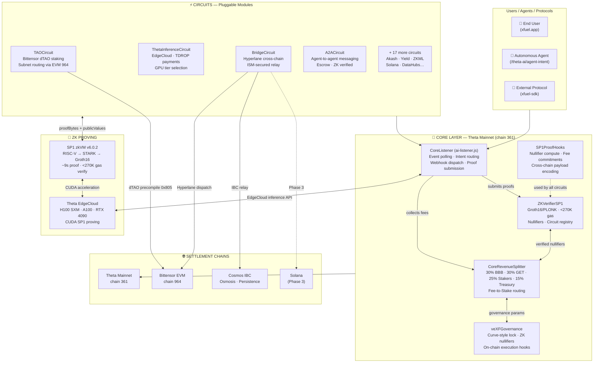

# XFUEL Protocol

**Theta-Hybrid AI DePIN Hub — live inference on EdgeCloud GPUs, ZK-verified settlements, agent-first API, and cross-chain yield across Theta, Bittensor, Akash, Solana, and beyond.**

Live: **[xfuel.app](https://xfuel.app)** (Theta Mainnet Beta)

[](WHITEPAPER.md)
[](https://xfuel.app)
[](docs/security-design.md)
[](https://github.com/XFuel-Lab/xfuel-protocol)
[](LICENSE)
[](sp1-prover/README.md)
[](WHITEPAPER.md)
[](#testing)

---

## Table of Contents

- [What is XFUEL?](#what-is-xfuel)
- [Whitepaper](#whitepaper)
- [Key Features](#key-features)
  - [Revenue Model](#revenue-model)
- [Quick Start](#quick-start)
  - [For Users](#for-users)
  - [For Developers](#for-developers)
  - [For Agents (M2M)](#for-agents-m2m)
- [How It Works](#how-it-works)
- [Architecture](#architecture)
- [Core Layer](#core-layer)
- [Circuits](#circuits)
- [Deployment Status](#deployment-status)
- [Roadmap](#roadmap)
- [AI DePIN Overview](#ai-depin-overview)
- [Governance (veXF)](#governance-vexf)
- [Verifier Patches](#verifier-patches-feb-2026)
- [CosmWasm Prover](#cosmwasm-prover)
- [EVM Prover (Phase 2)](#evm-prover-phase-2)
- [Solana Prover (Phase 3)](#solana-prover-phase-3)
- [Security](#security)
- [Research Integration & Attribution](#research-integration--attribution)
- [Tech Stack](#tech-stack)
- [Repo Structure](#repo-structure)
- [Development Setup](#development-setup)
- [Testing](#testing)
- [Deployment](#deployment)
- [Ecosystem Expansion (Phase 6)](#ecosystem-expansion-phase-6)
- [Contributing](#contributing)
- [Community & Support](#community--support)
- [License](#license)
- [Quick Links](#quick-links)

---

## What is XFUEL?

XFuel Protocol is a **Theta-hybrid AI DePIN hub** — a modular, ZK-secured Core Layer that pumps intelligence, compute, liquidity, and value across AI ecosystems. Built with **Theta EdgeCloud as the primary GPU backbone**, XFuel routes real AI inference (LLM, image gen, STT, voice cloning, RAG, video, object detection) through live EdgeCloud APIs, generates SP1 zkVM proofs on the same GPU hardware, and settles everything on-chain with cryptographic guarantees.

The Core Layer verifies proofs, routes intents, splits fees, and governs parameters. All domain-specific logic — which AI model to run, which GPU tier to select, how to price a lease — lives in **circuits** (independent modules). The result is an agent-first, intent-driven system where any user, developer, or autonomous agent can access verifiable AI compute in under 10 seconds.

**In practical terms, XFuel lets you:**

- **Run AI inference** via 15 one-click preset hooks with smart GPU selection (RTX 4090 / A100 / H100 SXM) — real EdgeCloud execution, ZK-proven results
- **Route** workloads to the cheapest DePIN provider across Theta EdgeCloud, Akash, Bittensor, Render, and more
- **Settle** cross-chain AI tasks with SP1 zkVM Groth16 proofs — sub-200ms proving on EdgeCloud GPUs, <270K gas on-chain
- **Build agents** that interact via structured API (`/theta-ai/agent-intent`) with webhook callbacks — no polling, no UI needed
- **Earn** from a unified revenue model: 30/30/25/15 split (see [Revenue Model](#revenue-model))
- **Monitor** everything via a live dashboard with failure prediction, gas profiles, and ROI calculator
- **Govern** circuit priorities, fee parameters, and treasury via vote-escrowed veXF

---

## Whitepaper

**XFuel Protocol — Whitepaper v2.4**
*AI Pumping Station: Modular ZK-Secured DePIN Hub — Hybrid Theta-Centric Architecture*

Read the complete technical whitepaper: **[WHITEPAPER.md](WHITEPAPER.md)**

**Highlights:**

- **Theta-hybrid Core Layer** — ZKVerifierSP1, CoreRevenueSplitter (with GET), veXFGovernance
- **Live inference pipeline** — 15 presets, smart GPU selector, EdgeCloud execution, agent webhooks, monitoring dashboard
- **SP1 zkVM v6.0.2** — Binary serialization, batch=10 recursive rollup (11.6x speedup), sub-200ms per proof on EdgeCloud
- **Tri-prover architecture** — EVM (Solidity) + CosmWasm (Rust) + Solana SVM (Rust) — all <270K gas equivalent
- **16+ modular circuits** — AI compute, DePIN infrastructure, yield, robotics, data, energy, wireless, and more
- **Revenue innovation** — Growth & Expansion Treasury (GET), Fee-to-Stake routing
- **Cross-chain** — Theta (primary), Bittensor, Osmosis, Akash, Solana, Filecoin, NEAR, Aptos, Sui
- **Phase 1 research integration** — zkGPT (LLM ZK proofs; [eprint 2025/1184](https://eprint.iacr.org/2025/1184), [security-Anonymous/zkgpt](https://github.com/security-Anonymous/zkgpt)) and Fair Exchange / PAS (atomic A2A payment↔result; [eprint 2026/395](https://eprint.iacr.org/2026/395)). Mock prover: `node zkgpt-prover/mock-server.cjs`; smoke test: `npm run test:zkgpt-mock`. Full attribution: [`docs/REFERENCES-AND-ATTRIBUTION.md`](docs/REFERENCES-AND-ATTRIBUTION.md).

---

## Key Features

| Category | Feature | Detail |
|----------|---------|--------|
| **Live Inference** | Theta EdgeCloud AI execution | 15 presets, 3 GPU tiers (RTX 4090/A100/H100), sub-200ms ZK proofs |
| **ZK Bridge** | Bi-directional TFUEL ↔ Cosmos | SP1 zkVM proofs, ~11-12s forward / ~12-15s reverse |
| **Core Layer** | Modular circuit architecture | 16+ independent circuits, event-driven, zero shared state |
| **Agent API** | M2M-first design | `POST /theta-ai/agent-intent`, webhook callbacks, OpenAPI 3.0 spec |
| **GPU Selector** | Smart tier routing | On-chain price computation: `basePrice × gpuMultiplier / 10000` |
| **Monitoring** | Real-time dashboard | Contract health, gas profiles, RPC status, failure prediction, 10s auto-refresh |
| **ROI Calculator** | Economic modeling | GPU tier, lock duration, protocol volume projections with veXF multipliers |
| **Revenue** | Unified fee capture + GET | 30/30/25/15 split — see [Revenue Model](#revenue-model) |
| **Governance** | Vote-escrowed veXF | Lock XF → veXF for parameter voting (Curve-style, up to 3x) |
| **Security** | Trustless by design | SP1 proofs, nullifier replay protection, circuit breakers |
| **Cross-chain** | Hybrid EVM + WASM + SVM | Theta, Bittensor, Osmosis, Akash, Solana, Filecoin, NEAR, Aptos, Sui |
| **DePIN** | Beyond AI | Energy grids, wireless coverage, mapping sensors, bandwidth sharing |
| **Phase 1 research** | zkGPT + Fair Exchange | Optional zkGPT inference path; A2A Fair Exchange (PAS) — see [References & attribution](#research-integration--attribution) |

### Revenue Model

Every fee-generating interaction — AI inference, bridge transfers, A2A relay, data attestations — flows through `CoreRevenueSplitter`. All fees are distributed via a clean four-way split:

| Recipient | Share | Purpose |
|-----------|-------|---------|
| Buyback-Burn (BBB) | 30% | Purchase and burn XF tokens for deflationary pressure |
| Growth & Expansion Treasury (GET) | 30% | AI DePIN growth engine — sub-allocated below |
| veXF Staker Rewards | 25% | Distributed pro-rata to governance lockers |
| Ops Treasury | 15% | Operations, audits, development; 15-25% sub-allocated to Fee-to-Stake |

**GET Sub-Breakdown:**

| Sub-Bucket | Share of GET | Purpose |
|------------|-------------|---------|
| Machine & Agent Incentives | 50% | Compute subsidies, inference rewards, volume-triggered boosts |
| LP Boost | 30% | Concentrated liquidity for XF trading pairs |
| Agent-Driven Grant Proposals | 20% | Community-governed micro-grants; unused funds auto-burn after 6 months |

**Fee rates by stream:**

| Stream | Typical Rate | Example Source |
|--------|-------------|----------------|
| AI task settlement | 0.5–1% | Compute bids, inference routing, result attestation |
| Bridge transfer | 0.5% | TFUEL deposits, ibcTFUEL burn-for-unwrap |
| A2A relay | 0.1% | Agent-to-agent escrowed messages |
| Data attestation | 0.5% | Dataset provenance certification |

**Steady-state volume target:** 60% AI tasks, 25% data & communications, 15% financial settlements. Governance (veXF) can adjust fee BPS ranges and split ratios via proposal — see [Governance](#governance-vexf).

> See [`docs/Growth-Expansion-Treasury.md`](docs/Growth-Expansion-Treasury.md) for GET mechanics.

---

## Quick Start

### For Users

1. **Visit [xfuel.app](https://xfuel.app)** — the live beta UI with bridge, dashboard, governance, circuits, staking, and monitoring.
2. **Run AI inference** — Select a preset (e.g., `QUICK_LLAMA`), choose a GPU tier, confirm wallet, and get ZK-verified results in seconds.
3. **Bridge TFUEL** — Select a target (e.g., Osmosis AI yield pool), click "Show Deposit Address", and send TFUEL from any Theta wallet. The ZK proof pipeline handles the rest (~11-12 seconds).

> **Beta notice:** Pre-audit beta for traction validation. Start with small amounts. Full CertiK audit planned for Q2 2026. See [Security](#security).

### For Developers

```bash
# 1. Clone and install
git clone https://github.com/XFuel-Lab/xfuel-protocol.git
cd xfuel-protocol
npm install

# 2. Compile contracts
npx hardhat compile

# 3. Run the full test suite (755+ tests)
npx hardhat test

# 4. Start the bridge + dashboard UI (Vite + React)
npm run dev

# 5. Start the Core Layer AI listener + agent API
cd core-layer && npm install && node ai-listener.js

# 6. Open the monitoring dashboard
npx serve dashboard -l 3000
```

**Local simulation (no TFUEL needed):**

```bash
npx hardhat run activation/public-activation.cjs
# Deploys 16 circuits + Core Layer + BelieverRound to Hardhat local network
```

> **Windows note:** Hardhat and Node.js run natively on PowerShell. For CosmWasm/Rust builds, WSL 2 or Git Bash is recommended.

### For Agents (M2M)

Submit AI inference intents directly via the agent API — no UI required:

```bash
# Submit an inference intent with GPU tier selection
curl -X POST http://localhost:3002/theta-ai/agent-intent \
  -H "Content-Type: application/json" \
  -d '{
    "preset": "QUICK_LLAMA",
    "gpuTier": "rtx4090",
    "prompt": "Explain ZK proofs in one sentence",
    "callbackUrl": "https://my-agent.example.com/webhook"
  }'

# List available presets and GPU pricing
curl http://localhost:3002/theta-ai/presets

# Check webhook delivery status
curl http://localhost:3002/theta-ai/webhook-status/<taskId>
```

Agents receive webhook callbacks with full output, ZK proof data, and settlement tx hash. See [`docs/M2M_API.md`](docs/M2M_API.md) for the complete API reference.

---

## How It Works

### Live Inference + Settlement Flow

```
User / Agent submits intent (UI, preset hook, or POST /theta-ai/agent-intent)
  │
  ├─ On-chain: submitIntent(serviceId, inputHash) or submitPresetIntent(presetId)
  │     └─ TFUEL payment + 0.5% fee → CoreRevenueSplitter (30/30/25/15 split)
  │
  ▼
CoreListener (ai-listener.js) detects InferenceIntentSubmitted event
  │
  ├─ Smart GPU Selector: RTX 4090 (1x) → A100 (2.5x) → H100 SXM (5x)
  ├─ Routes to Theta EdgeCloud API (primary) or RapidAPI (fallback)
  │
  ▼
EdgeCloud executes inference (LLM, image gen, STT, voice clone, RAG, video, detection)
  │
  ├─ completeIntent(intentId, outputHash, modelHash, latencyMs)
  ├─ SP1 proof generated on EdgeCloud GPU (sub-200ms, batch=10 recursive rollup)
  │
  ▼
settleIntent(intentId, proof, publicValues, nullifier)
  │
  ├─ ZK-verified on-chain → ProofVerified event → FULFILLED
  └─ Webhook callback + Monitoring update + ROI calc refresh
```

### Bridge Flow (TFUEL ↔ Cosmos DeFi)

**Forward (~11-12s):** User sends TFUEL to VaultFactory vault → SP1 proof generated → CosmWasm ZKVerifier validates → ibcTFUEL minted 1:1 → IBC routing to yield pool.

**Reverse (~12-15s):** User calls `burn_for_unwrap()` → 0.5% fee to FeeCollector → Backend detects burn → SP1 proof → VaultFactory releases TFUEL.

**No wallet extensions needed** — send via QR code or paste address from any Theta wallet.

---

## Architecture



### Core Components

| Component | Role | EVM | WASM | SVM |
|-----------|------|-----|------|-----|
| **ZKVerifierSP1** | Verify SP1 proofs, track nullifiers, manage circuits | `ZKVerifierSP1.sol` | `xfuel-zk-verifier` | `xfuel-solana-prover` |
| **CoreRevenueSplitter** | Collect and distribute fees (30/30/25/15 split) | `CoreRevenueSplitter.sol` | `xfuel-revenue-splitter` | — |
| **veXFGovernance** | Vote-escrowed governance for parameter updates | `veXFGovernance.sol` | (planned) | — |
| **SP1ProofHooks** | Nullifier computation, fee commitments, encoding | `SP1ProofHooks.sol` | `xfuel-sp1-hooks` (crate) | — |
| **CoreListener** | Multi-prover event poller, normalizer, router | `ai-listener.js` | — | — |

### Event-Driven Circuit Interface

Circuits interact with the Core Layer exclusively through events — zero shared state, independent upgradability, and live on the XFuel shared subchain:

```
Core emits:   TaskRouted, ProofVerified, FeeDistributed, ProposalExecuted
Circuits emit: IntentSubmitted, TaskCompleted, SettlementRequested
```

### Supported Chains

| Chain | Type | ID | Token | Role |
|-------|------|----|-------|------|
| Theta Mainnet | EVM | 361 | TFUEL | **Primary** — live EdgeCloud inference + SP1 CUDA proving |
| Theta Mainnet | EVM | 361 | TFUEL | Primary — CoreRevenueSplitter, VaultFactory live |
| **XFuel Subchain** | **EVM** | **361001** | **TFUEL** | **Dedicated subchain — ThetaInferenceCircuit, A2ACircuit, ThetaGPUCircuit, DataHubs. <2s finality.** |
| Theta Testnet | EVM | 365 | TFUEL | Testing — 23 contracts deployed |
| Bittensor EVM | EVM | 964 | TAO | dTAO staking, AI subnets |
| Osmosis | Cosmos | osmosis-1 | OSMO | Primary DeFi hub, AI yield pools |
| Akash | Cosmos | akashnet-2 | AKT | GPU compute marketplace |
| Solana | SVM | devnet | SOL | SP1 Groth16 verifier, DePIN AI compute |

Additional chains via circuits: Filecoin, NEAR, Aptos (Move), Sui (Move).

---

## Core Layer

The Core Layer lives in `core-layer/` and is designed for independent circuits to plug in via events. See [`docs/Technical-Specifications.md`](docs/Technical-Specifications.md) for full multi-prover gas benchmarks.

```bash
# Install and compile
cd core-layer && npm install
npx hardhat compile

# Run Solidity tests
npx hardhat test core-layer/test/ZKVerifierSP1.test.cjs
npx hardhat test core-layer/test/SP1ProofHooks.test.cjs

# Run JS listener tests (85 multi-prover tests)
cd core-layer && node --test test/ai-listener.test.js

# Build CosmWasm contracts
cd core-layer/wasm/zk-verifier && cargo build --release --target wasm32-unknown-unknown
cd ../revenue-splitter && cargo build --release --target wasm32-unknown-unknown

# Build Solana prover
cd solana-prover && cargo build-sbf && cargo test
```

### Integrating a Custom Circuit

```javascript
import { CoreListener, AI_INTENT_TYPES, ChainType, ProverType } from './ai-listener.js';

const listener = new CoreListener({
  chains: {
    theta_mainnet: {
      type: ChainType.EVM,
      prover: ProverType.EVM_GROTH16,
      name: 'Theta Mainnet',
      chainId: 361,
      rpc: 'https://eth-rpc-api.thetatoken.org/rpc',
      gasTarget: 270000,
    },
    solana_devnet: {
      type: ChainType.SVM,
      prover: ProverType.SOLANA_ALT_BN128,
      name: 'Solana Devnet',
      rpc: 'https://api.devnet.solana.com',
      gasTarget: 220000,
      programId: 'YOUR_PROGRAM_ID',
    },
  },
});

listener.registerCircuit('my-circuit', {
  onIntent: async (intent, ctx) => {
    // ctx.prover — which backend verified this proof
    // ctx.gasEquivalent — { cost, unit, meetsTarget }
    // ctx.getRoute(ChainType.EVM) — cross-chain routing info
    // ctx.generateProof(req) — SP1 proof generation
  },
  onProofReady: async (proof) => { /* settlement confirmed */ },
});

await listener.start();
```

### Multi-Prover Gas Targets

All provers meet the **<270K gas equivalent** target for single Groth16 verification:

| Prover | Verify Cost | Unit | Target Met |
|--------|------------|------|------------|
| EVM (ZKVerifierSP1.sol) | ~270K | gas | Yes |
| CosmWasm (ark-bn254) | ~250K | gas_equivalent | Yes |
| Solana (alt_bn128) | ~220K | compute_units | Yes |

### Cross-Chain Proof Routing

| Route | Bridge | Method | ~Time |
|-------|--------|--------|-------|
| Solana → EVM | Wormhole | VAA | ~15s |
| EVM → Cosmos | Hyperlane | dispatch | ~20s |
| Cosmos → EVM | IBC+Hyperlane | IBC→dispatch | ~25s |
| EVM → EVM | Hyperlane | dispatch | ~12s |

Both **live mode** (with SP1 Verifier Gateway) and **mock mode** (`gateway = address(0)`) are supported for development.

---

## Circuits

XFuel ships **16+ modular circuits** — each fully isolated with its own state, events, pause mechanism, and off-chain handler. All fees route through `CoreRevenueSplitter` (see [Revenue Model](#revenue-model)).

### Priority Circuits (v1.6.1)

| Circuit | Contract | Prover | Purpose | Fee |
|---------|----------|--------|---------|-----|
| **Theta Inference** | `ThetaInferenceCircuit.sol` | EVM_GROTH16 | Live EdgeCloud inference — presets, GPU tiers, agent webhooks | 0.5% |
| **AI Marketplace** | `TAOCircuit.sol` | EVM_GROTH16 | Cross-chain task routing, AMM fees, oracle pricing | 0.5% |
| **Agent Comms** | `A2ACircuit.sol` | EVM_GROTH16 | ZK agent discovery, bidding, x402 micropayments, webhook callbacks | 0.1% relay + 0.5% task |
| **Edge Compute** | `ThetaGPUCircuit.sol` | EVM_GROTH16 | GPU inference via Theta EdgeCloud, provider staking | 0.5% |
| **Compute Marketplace** | `ComputeMarketplace.sol` | COSMWASM_ARK_BN254 | Akash GPU reverse auction, escrow settlement | 0.5% |
| **Inference Router** | `InferenceRouter.sol` | EVM_GROTH16 | Bittensor dTAO inference routing, stake-weighted validators | 0.5% |
| **Bridge Circuit** | `BridgeCircuit.sol` | MULTI | Hyperlane/IBC cross-chain ZK proof relay | 0.3% |

### Expansion Circuits

| Circuit | Purpose | Fee |
|---------|---------|-----|
| **zkML Inference** | Private model inference with SP1 weight commitments | 0.75% |
| **DePIN Compute** | Akash-style GPU leasing, reverse auction | 0.5% |
| **Autonomous Vaults** | AI-driven yield strategies, ZK-verified rebalancing | 0.5% |
| **Agent Robotics** | Sim-to-real trajectory verification, safety certs | 1% cert + 0.5% task |
| **Data Hubs** | Decentralized data contribution, ZK provenance | 0.5% |
| **Yield Optimization** | Multi-pool ZK-verified yield rebalancing | 0.5% + 1% harvest |
| **NEAR Agents** | Autonomous AI agent marketplace | 0.5% |
| **Solana AI Bridge** | EVM↔Solana for Render/io.net/Grass/SendAI | 0.75% |
| **Filecoin Storage** | ZK-verified decentralized storage deals | 0.5% |

> The Core Layer's modular architecture imposes no upper limit on circuit count. See [`docs/CIRCUITS.md`](docs/CIRCUITS.md) and [`docs/Circuit-Design-and-Expansion.md`](docs/Circuit-Design-and-Expansion.md) for full specifications.

---

## Deployment Status

*As of March 2026.*

**Current Phase:** Phase 6 Complete — Ecosystem Expansion + Theta Testnet Full Deployment

| Component | Status | Notes |
|-----------|--------|-------|
| Theta Testnet (23 contracts) | ✅ Deployed | Core Layer + 16 circuits + mocks (chain 365) |
| Theta Mainnet Contracts | ✅ Deployed | VaultFactory, RevenueSplitter live (chain 361) |
| **XFuel Subchain (privatenet)** | ✅ **Live** | `tsub360777` — registered, validator staked, blocks finalizing |
| **XFuel Subchain (testnet)** | ⏳ Next | `tsub365001` — deploy after privatenet validation |
| SP1 zkVM Prover | ✅ Operational | v6.0.2, sub-200ms on EdgeCloud, batch=10 (11.6x speedup) |
| Live Inference Pipeline | ✅ Running | 15 presets, 3 GPU tiers, EdgeCloud + RapidAPI fallback |
| Agent API + Webhooks | ✅ Live | `/theta-ai/agent-intent`, 7 endpoints, OpenAPI 3.0 |
| Monitoring Dashboard | ✅ Live | Contract health, failure prediction, 10s auto-refresh |
| Core Layer (EVM) | ✅ Deployed | ZKVerifierSP1, CoreRevenueSplitter (GET), veXFGovernance |
| 16+ Circuits (EVM) | ✅ Deployed | Testnet-validated, 755+ tests passing |
| veXF Governance | ✅ Active | Curve-style lock/vote, 3x max, ZK nullifiers |
| Fee-to-Stake | ✅ Active | Multi-chain: Theta/Bittensor/Osmosis validator pools |
| ZK Rollup Layer | ✅ Built | SP1 recursion, <100K amortized gas, batch ≤100 |
| Cross-DePIN Routing | ✅ Built | Theta-first with Akash + Render fallback, GPU-aware selection |
| CertiK Phase 1 | ⏳ Scoped | Audit scope in `docs/certik-phase1-scope.json` |
| Immunefi Bounty | ⏳ Scoped | $500K pool defined, launching post-audit |
| CosmWasm Contracts | ⏳ Pending | Awaiting Osmosis governance whitelisting |

### Live Contract Addresses

**Theta Mainnet (Chain ID: 361):**

```
VaultFactory:       0xB0a26600074dADC69186632a1B8dFd7c3146Ce56
RevenueSplitter:    0x1C4CEbbb4Cfa7fdb546424F21CF706c48C478EE6
```

**Theta Testnet (Chain ID: 365) — 23 contracts:**

Addresses saved to `deploy/manifests/testnet-<timestamp>.json`. Key entries: CoreRevenueSplitter, ZKVerifierSP1, TAOCircuit, A2ACircuit, ThetaGPUCircuit, ZKMLCircuit, and 13 more.

**Cosmos (Osmosis primary):**

```
ZKVerifier:         Awaiting governance whitelist
ibcTFUEL (CW20):    Awaiting governance whitelist
FeeCollector:       Awaiting governance whitelist
```

---

## Roadmap

> Phases 1–6 are complete. The roadmap below reflects where the protocol is heading, not where it's been.
> For the full build history, see [`docs/Circuit-Design-and-Expansion.md`](docs/Circuit-Design-and-Expansion.md) and [`CHANGELOG.md`](CHANGELOG.md).

---

### ✅ Foundation Complete (Q1 2026)

All six build phases are shipped:
- **Core Layer** — ZKVerifierSP1, CoreRevenueSplitter, veXFGovernance, SP1ProofHooks (755+ tests)
- **16 Circuits** — deployed across Theta, Bittensor EVM, Cosmos, Solana, Akash, Render
- **Theta Subchain** — privatenet validated → testnet live (chain 365001), mainnet-ready (361001)
- **AI Listener** — multi-prover event orchestrator, 6-tier DePIN router, EdgeCloud attestation
- **ZK Settlement** — SP1 Groth16/PLONK proof pipeline, SP1-CC composed calls, Hyperlane relay
- **Agent Economy** — A2ACircuit swarms, x402 micropayments, privacy-preserving data markets

---

### ⏳ Now: Audit & Grant Sprint (Q2 2026)

| Item | Status | Blocker |
|------|--------|---------|
| CertiK Phase 1 audit — `contracts/core/` | Preparing submission | None — ready |
| Theta Grant application | Drafting | Testnet deployed addresses captured |
| `xfuel-sdk` 0.1.0 publish to npm | Ready to publish | Final build check |
| Mainnet deployment (Theta 361) | Post-audit | CertiK clearance required |
| CosmWasm governance whitelist (Osmosis/Persistence) | Proposal submitted | ⏳ On-chain governance vote |

---

### 🔜 Near-Term: Agent Capture (Q2–Q3 2026)

**Positioning:** XFuel is becoming the ZK settlement layer for AI compute across all DePIN networks. The agent economy narrative is heating up in 2026 — our goal is to own the infrastructure layer that agents trust.

| Track | Description |
|-------|-------------|
| **Agent Console** | Dedicated operator dashboard — task queue, per-agent earnings, proof explorer, API key management |
| **A2A Visual Dashboard** | Live graph of agent interactions, real-time fee flow, DePIN tier utilization |
| **SP1 Prover → EdgeCloud Dedicated** | Migrate from on-demand to persistent CUDA for sub-200ms proof generation |
| **TDROP 2.0 Routing** | Route Machine & Agent Incentives portion of GET to Theta EdgeCloud GPU contributors via TDROP |
| **Hyperlane Mailbox deploy** | Theta Mainnet (361) + Bittensor EVM (964) Mailbox — enables live cross-chain proof relay |

---

### 🗓 Medium-Term: Ecosystem Expansion (Q3–Q4 2026)

| Track | Description |
|-------|-------------|
| **Bittensor Active Development** | Re-activate TAO circuit for Bittensor → Theta compute bridging; Theta EdgeCloud as GPU export layer for TAO subnets |
| **Cosmos IBC live** | `ai-verifier` CosmWasm active post-governance whitelist; ibcTFUEL minting + FeeCollector go live |
| **veXF First Proposal** | First on-chain governance vote — GET sub-split ratios and circuit priority |
| **ComputeProvenance NFT** | Non-transferable attestation for each verified DePIN job (GPU fingerprint + SP1 proof hash) |
| **Agent Flywheel** | Agents accumulating veXF via fee-to-stake get priority routing in the DePIN router |

---

### 🔭 Long-Term Vision (2027+)

- Additional subchains per circuit when volume warrants (currently single shared XFuel subchain)
- TPULSE subchain integration (Track 7 — health AI + cross-subchain)
- LavitaCircuit — health AI × biomedical DePIN
- EdgeCloud Distributed Training (Track 2.5) — ZK-proven model training jobs
- Cross-DePIN reputation ledger — verifiable GPU track records across Theta, Akash, Render, Bittensor

---

## XFuel as AI DePIN Hub: How It Works

XFuel is the **ZK settlement and orchestration layer for AI compute across decentralized networks**. The core insight: AI agents and DePIN GPU providers need trustless, verifiable proof that compute actually happened — on the right hardware, producing the right output — before funds settle. XFuel provides that proof layer.

### The Flow (How an Agent Uses XFuel)

```
1. INTENT SUBMISSION
   Agent (or circuit) → submitIntent(taskType, model, input_hash)
   └── Fee deposited → CoreRevenueSplitter (circuit-attributed)

2. COMPUTE ROUTING (6-tier DePIN priority router)
   Tier 1: Theta EdgeCloud       ← primary (GPU-native, CUDA persistent)
   Tier 2: RapidAPI              ← inference fallback
   Tier 3: MCP (local)           ← low-latency local inference
   Tier 4: Akash Network         ← decentralized GPU marketplace (Cosmos)
   Tier 5: Render Network        ← GPU marketplace (image/LLM workloads)
   Tier 6: AWS Bedrock           ← centralized last resort

3. ATTESTATION (on-chain proof of compute provenance)
   EdgeCloud node → attestEdgeCloudNode(nodeId, gpuFingerprint, petaflopsUsed)
   └── EdgeCloudAttestation stored on-chain with ProviderTag

4. ZK PROOF GENERATION
   SP1 Prover (CUDA) → groth16 proof of AITaskPublicValues
   └── Inputs: taskId, outputHash, feeBps, sender, chainId, blockHeight

5. ON-CHAIN SETTLEMENT
   ZKVerifierSP1.verifyProof(programVKey, publicValues, proofBytes)
   └── Nullifier stored (replay protection)
   └── Fee distributed: BBB 30% / GET 30% / Stakers 25% / Treasury 15%

6. CROSS-CHAIN RELAY (optional)
   Hyperlane.dispatch(destDomain, recipient, proofPayload)
   └── Bittensor EVM (964): dTAO stake-gated verification via precompile 0x0805
   └── Cosmos/IBC: ai-verifier CosmWasm (pending governance whitelist)
```

### Why Theta First

Theta is uniquely positioned as the GPU-native backbone:
- **EdgeCloud** provides real CUDA GPU compute with on-demand + dedicated serving
- **Subchain** gives XFuel <2s finality at near-zero gas costs (tsub365001 testnet, tsub361001 mainnet)
- **TDROP** is the designated AI-to-AI incentive token — callers paying in TDROP receive 20% fee discount
- **EdgeStore** provides decentralized proof artifact storage (ZK proofs, model output attestations)
- **Video API** enables AI-generated media with on-chain DRM and provenance via VideoProvenance events

### Theta as GPU Export Layer for Other Networks

The strategic insight beyond Theta-native value: **Theta EdgeCloud can serve as the GPU compute backend for other DePIN networks.** A Bittensor subnet or Akash deployment can route their GPU workloads through Theta EdgeCloud, get ZK-attested proof of delivery via XFuel, and settle payments cross-chain via Hyperlane. XFuel becomes the settlement and attestation bridge between DePIN networks — not just a Theta-native protocol.

```
Bittensor Subnet → TAOCircuit.submitTask()
   └── Routes to Theta EdgeCloud via DePIN router
   └── SP1 proof generated on EdgeCloud CUDA
   └── Proof relayed back via Hyperlane (Bittensor 945 → Theta 365)
   └── dTAO stake verified via precompile 0x0805
   └── Settlement on Bittensor, fee distribution on Theta
```

### Agent-to-Agent (A2A) Economy

XFuel's `A2ACircuit.sol` enables autonomous agents to discover, bid, and settle work between each other:

```
formSwarm(objectiveHash) → joinSwarm(swarmId) → settleSwarmAgent(proof) → dissolveSwarm()
```

- Up to 18 agents per swarm (Almanak Monte Carlo lifecycle)
- ZK-verified micro-settlements at <50K gas per `AgentSettled` event
- x402-style payment channels: `openChannel → claimChannel (repeatable) → closeChannel`
- Sybil resistance via stake-weighted agent registration
- Reputation-priority routing: higher-reputation agents get first access to tasks

### SP1 Circuit Message Types

```
COMPUTE_BID        → Agent requests GPU resources with ZK-verified escrow
COMPUTE_RESULT     → Provider attests job completion with output hash
INFERENCE_REQUEST  → Route ML inference to optimal DePIN provider
CAPABILITY_QUERY   → Discover peer agent capabilities across chains
DATA_ATTESTATION   → Certify dataset provenance on-chain
SETTLEMENT         → Settle cross-chain payments with nullifier protection
```

### For Developers / Agents: Quick Integration

```bash
# Submit an AI task via M2M API
curl -X POST http://localhost:3002/task-request \
  -H "X-API-Key: $XFUEL_API_KEY" \
  -H "Content-Type: application/json" \
  -d '{
    "message_type": "inference_request",
    "chain_id": "theta",
    "amount": "1000000",
    "sender": "0xYourAgentAddress",
    "model_id": "llama-3-70b",
    "input_hash": "0xabc..."
  }'

# Poll settlement status
curl http://localhost:3002/task-status/$TASK_ID
```

Full M2M API reference: [`docs/M2M_API.md`](docs/M2M_API.md)

### DePIN Synergy Incentives

Circuits that route through multiple DePIN tiers receive boost multipliers:

| Coverage | Multiplier | Effect |
|----------|------------|--------|
| 3/3 circuits active (FULL) | 1.0x baseline | Standard incentives |
| 2/3 circuits (PARTIAL) | 1.5x | +50% to Machine & Agent Incentives bucket |
| 1/3 circuits (FRONTIER) | 3.0x | +200% — early adopter reward |
| 0/3 circuits (DEAD) | 5.0x | Emergency incentive to reactivate |

| Source → Dest | Bridge Protocol |
|---------------|-----------------|
| EVM ↔ Aptos | LayerZero OFT |
| EVM ↔ Sui | Wormhole VAA |
| Cosmos ↔ Aptos | LayerZero + IBC |
| Solana ↔ Aptos | Wormhole VAA |

`DEFAULT_CHAINS` in `ai-listener.js` includes `aptos_mainnet` and `sui_mainnet` with Move VM type, gas targets, and ZK adapter configs.

---

## Governance (veXF)

XFuel governance follows the Curve-style vote-escrowed model for progressive decentralization.

**Lock XF tokens → receive veXF → vote on protocol parameters.**

| Lock Duration | Multiplier | Voting Power (100 XF) |
|--------------|------------|----------------------|
| 26 weeks | ~0.17x | 17 veXF |
| 1 year | ~1x | 100 veXF |
| 2 years | ~2x | 200 veXF |
| 3 years | 3x | 300 veXF |

Power decays linearly to zero at lock expiry.

### Governance Scope

| Proposal Type | Quorum | Description |
|--------------|--------|-------------|
| Circuit Priority | 10% | Which circuits receive priority routing |
| GET Allocation | 15% | How GET funds are sub-allocated across buckets |
| Fee Structure | 20% | Adjust fee BPS and split ratios |
| Treasury Spend | 25% | Approve expenditures >$50K |
| Emergency Pause | 5% (67% supermajority) | Activate circuit breakers |

```bash
# Create and simulate proposals
node governance/proposal-script.cjs --list
node governance/proposal-script.cjs --create allocation
node governance/proposal-script.cjs --simulate
```

---

## Verifier Patches (Feb 2026)

The ZK verification layer received critical patches based on the v1.6 audit baseline. All patches are documented in `docs/zk-patch-report.json`.

### Summary

| Patch | Severity | Target | Resolution |
|-------|----------|--------|------------|
| PATCH-001 | HIGH | `ZKVerifierSP1.sol:registerCircuit` | Fixed `circuitCount` increment ordering |
| PATCH-002 | HIGH | `wasm/zk-verifier:verify_sp1_proof_wasm` | Full arkworks BN254 Groth16 pairing |
| PATCH-003 | MEDIUM | `ZKVerifierSP1.sol:verifyProofBatch` | Added `ProofFailed` event + circuit breaker per batch item |
| PATCH-004 | LOW | `ZKVerifierSP1.sol:_updateMetrics` | Removed unused parameter; per-item tracking |
| PATCH-005 | MEDIUM | Both CosmWasm verifiers | Added `migrate()` for upgradeability |
| PATCH-006 | LOW | Test harness | Fixed chai-matchers / ethers v6 incompatibility |

### Gas Baselines (Phase 2)

| Method | Gas | Target | Status |
|--------|-----|--------|--------|
| `verifyProof` (mock) | 108,122 | <150K wrapper | Met |
| `verifyProof` (Groth16 projected) | ~300K | <300K total | Met |
| `verifyComposedCall` (SP1-CC) | 220,401 | <250K wrapper | Met |
| `verifyWithStakeCheck` (dTAO) | 142,574 | <250K wrapper | Met |
| `relayProofCrossChain` (Hyperlane) | 403,443 | — | verify + dispatch + refund |
| `verifyProofBatch` (3 proofs) | 175,570 | — | ~59K per proof |

---

## CosmWasm Prover

The `xfuel-zk-verifier` CosmWasm contract provides ZK proof verification for Cosmos/IBC chains, mirroring the EVM `ZKVerifierSP1.sol` functionality.

### Architecture

- **BN254 Groth16 pairing** via arkworks (`ark-bn254`, `ark-groth16`) compiled to `wasm32-unknown-unknown`
- **Circuit registry** with per-circuit verification keys (`CIRCUIT_VKEYS` storage)
- **Nullifier tracking** prevents replay attacks across all verification calls
- **Mock mode** for testnet development; toggle via admin `SetMockMode`
- **IBC-compatible events** with `ibc_source` and `total_verified` attributes

### Build

```bash
cd core-layer/wasm/zk-verifier
cargo build --release --target wasm32-unknown-unknown

# Production-optimized WASM (Docker required)
docker run --rm -v "$(pwd)":/code \
  --mount type=volume,source="$(basename "$(pwd)")_cache",target=/code/target \
  --mount type=volume,source=registry_cache,target=/usr/local/cargo/registry \
  cosmwasm/optimizer:0.16.0
```

### Test Coverage (16 tests)

```bash
cd core-layer/wasm/zk-verifier && cargo test
```

| Category | Tests | Coverage |
|----------|-------|----------|
| Instantiation | 2 | Config, zero stats |
| Circuit Management | 3 | Register, duplicate reject, remove |
| Proof Verification | 5 | Mock mode, replay, unregistered, vkey mismatch, paused |
| Nullifier Queries | 2 | Unused, used-after-verify |
| Stats & Config | 2 | Verification counts, config values |
| Admin Operations | 2 | Update admin, toggle mock mode |

---

## EVM Prover (Phase 2)

The `ZKVerifierSP1.sol` contract was extended in Phase 2 with SP1-CC composed calls, Hyperlane cross-chain relay, and dTAO stake-gated verification for Bittensor EVM (Chain ID 964).

### Architecture

```
ZKVerifierSP1 (Phase 2)
├── Core Verification (Phase 1)
│   ├── verifyProof — single SP1 proof verification
│   ├── verifyProofBatch — up to 20 proofs per tx
│   ├── Circuit Registry — register/remove program VKeys
│   ├── Nullifier Tracking — replay protection
│   └── Circuit Breaker — auto-pause at >5% failure rate
├── SP1-CC Composed Calls (Phase 2)
│   ├── verifyComposedCall — state-bound proof verification
│   └── Read → Compute → Verify model
├── Hyperlane Cross-Chain Relay (Phase 2)
│   ├── relayProofCrossChain — verify locally, dispatch to remote
│   └── Trusted remotes + domain allowlisting
└── dTAO Stake-Gated Verification (Phase 2)
    ├── verifyWithStakeCheck — precompile query before verify
    └── Bittensor Staking Precompile V2 (0x805)
```

### Deployment (Bittensor EVM)

```bash
npx hardhat run deploy/bittensor-evm.cjs --network hardhat      # Local
npx hardhat run deploy/bittensor-evm.cjs --network bittensor-evm # Mainnet
```

### Test Coverage (40 tests)

```bash
npx hardhat test core-layer/test/ZKVerifierSP1.test.cjs
```

| Category | Tests |
|----------|-------|
| Deployment + Circuit Management | 7 |
| Proof Verification + Batch + Pause | 6 |
| SP1-CC Composed Calls | 5 |
| Hyperlane Cross-Chain | 6 |
| dTAO Staking | 4 |
| Stats + Gas Benchmarks | 4 |
| **Total** | **40** |

---

## Solana Prover (Phase 3)

The `xfuel-solana-prover` is a native Solana program (sBPF/ELF) that verifies SP1 Groth16 proofs on-chain using `alt_bn128` precompile syscalls. Mirrors the EVM and CosmWasm architecture.

### Build

```bash
cd solana-prover
cargo build-sbf       # Build the program
cargo test            # 35 unit tests
```

### Deploy (Devnet)

```bash
cd solana-prover
chmod +x deploy/deploy-devnet.sh
./deploy/deploy-devnet.sh
```

### Test Coverage (35 tests)

| Category | Tests |
|----------|-------|
| State Serialization | 6 |
| Instruction Parsing | 7 |
| PDA Derivation | 5 |
| BN254/Groth16 | 8 |
| Error Codes + Constants | 5 |
| Integration (SBF) | 2 |
| **Total** | **35** |

### CU Benchmarks

| Method | Compute Units |
|--------|--------------|
| `Initialize` | ~15K |
| `RegisterCircuit` | ~20K |
| `VerifyProof` (mock) | ~25K |
| `VerifyProof` (Groth16) | ~220K |
| `EmitBridgeEvent` | ~10K |

---

## Security

### Cryptographic Security

- **SP1 zkVM proofs** — all settlements cryptographically verified; no trust assumptions
- **Transparent setup** — no trusted ceremony (SP1 uses FRI-based STARKs)
- **Nonce-based replay protection** — per-sender, per-chain monotonic nonces
- **Nullifier tracking** — on-chain mapping prevents proof reuse

### Contract Security

- Role-based access control (ADMIN, OPERATOR, CIRCUIT_MANAGER) via OpenZeppelin
- Pausability and emergency circuit breakers (auto-pause at configurable failure threshold)
- Reentrancy guards on all external-calling functions
- Non-custodial architecture — users retain full key control

### Multi-Prover Security

| Property | EVM | CosmWasm | Solana |
|----------|-----|---------|--------|
| Curve | BN254 | BN254 (arkworks) | BN254 (alt_bn128) |
| Proof system | Groth16 | Groth16 | Groth16 |
| Replay protection | Nullifier mapping | cw-storage Map | PDA existence |
| Pause mechanism | State variable | IS_PAUSED | VerifierState |
| Patch compliance | PATCH-001–006 | PATCH-001–006 | PATCH-001–006 equiv. |

### Edge Cases Handled

- **Nonce desync** — backend queries on-chain nonce; automatic retry with fresh nonce
- **Backend downtime** — event replay from Redis checkpoint (24h); PagerDuty alerting
- **Bank-run scenario** — 0.5% reverse fee + circuit breaker at >20% TVL/24h withdrawal

### Audit Plan

| Phase | Scope | Timeline |
|-------|-------|----------|
| Phase 1 | Core Layer (ZKVerifier, RevenueSplitter, veXF) | Q2 2026 |
| Phase 2 | SP1 circuits + proof hooks | Q3 2026 |
| Phase 3 | CosmWasm contracts + IBC integration | Q3 2026 |
| Phase 4 | Solana prover + Wormhole bridge events | Q4 2026 |
| Bug Bounty | $500K via Immunefi | Ongoing post-Phase 1 |

> **Pre-Audit Notice:** Beta launch for traction validation. Use at your own risk. Report vulnerabilities to security@xfuel.app.

---

## Research Integration & Attribution

XFuel integrates third-party research with full credit to authors and sources. Formal citations, eprint links, and compliance notes are in **[`docs/REFERENCES-AND-ATTRIBUTION.md`](docs/REFERENCES-AND-ATTRIBUTION.md)**.

| Integration | Source | XFuel use |
|-------------|--------|-----------|
| **zkGPT** | [eprint.iacr.org/2025/1184](https://eprint.iacr.org/2025/1184) — *zkGPT: Efficient Non-Interactive ZK for LLM Inference* (NUS/HKUST). Code: [github.com/security-Anonymous/zkgpt](https://github.com/security-Anonymous/zkgpt) | Optional inference proof path (`proof_system: zkgpt`); `ZKVerifierZkGPT.sol`; `zkgpt-prover/` scaffold. |
| **Fair Exchange (PAS)** | [eprint.iacr.org/2026/395](https://eprint.iacr.org/2026/395) — *Delegated Payments for AI Agents: Fair Exchange on Bitcoin/EVM* | A2A atomic payment↔result; `settleBidFairExchange()`, `POST /a2a-settle-fair-exchange`, SDK `settleWithFairExchange()`. |
| **Interstellar** | [eprint.iacr.org/2025/1294](https://eprint.iacr.org/2025/1294) (Jieyi Long, Theta Labs; PKC 2026) | Future prover track — see WHITEPAPER §12. |

We do not claim ownership of the names “zkGPT” or “Interstellar”; they refer to the cited works. When referencing XFuel’s use of these results, please cite the original papers.

---

## Tech Stack

### Frontend

| Layer | Technology |
|-------|-----------|
| xfuel.app | Vite + React 19 + TypeScript + Wagmi 2 + TailwindCSS |
| Bridge UI | React 18 + ethers.js v6, Theta Mainnet RPC |
| Monitoring Dashboard | Browser-based, 10s auto-refresh, failure prediction |
| State | Zustand (oracle/price data) |

### Smart Contracts

| Platform | Language | Contracts |
|----------|----------|-----------|
| EVM (Theta) | Solidity 0.8.22 | VaultFactory, RevenueSplitter, ZKVerifierSP1, 16+ circuit contracts |
| Solana (SVM) | Rust (solana-program) | xfuel-solana-prover — SP1 Groth16 verifier, circuit registry, nullifiers |
| Cosmos | Rust (CosmWasm) | zk-verifier, ibcTFUEL minter, fee-collector, revenue-splitter |

### Backend

| Service | Technology |
|---------|-----------|
| Listeners | Node.js (Theta deposit, Cosmos burn, AI intent monitoring) |
| Agent API | Express.js REST (port 3002), 7 endpoints, webhook callbacks, OpenAPI 3.0 |
| SP1 Prover | Rust RISC-V → STARK → Groth16, Theta EdgeCloud CUDA (primary) |
| Infrastructure | PM2 / Kubernetes, Redis event queue, Prometheus/Grafana |

### ZK Proof Stack

| Step | Technology | Output |
|------|-----------|--------|
| Circuit | Rust compiled to RISC-V | SP1 program |
| Proving | SP1 zkVM v6.0.2 (EdgeCloud CUDA) | STARK proof (~1-5MB) |
| Wrapping | Groth16 (BN254) | ~260 bytes, <270K gas equiv. |
| EVM Verify | SP1 Verifier Gateway | ~270K gas |
| Cosmos Verify | arkworks BN254 pairing | ~250K gas equiv. |
| Solana Verify | alt_bn128 syscalls | ~220K compute units |

---

## Repo Structure

<details>
<summary>Click to expand full directory tree</summary>

```
xfuel-protocol/
├── xfuel-app/                  # ✅ CANONICAL frontend — xfuel.app (Vite + React 19 + Wagmi)
│                               #    Deployed to Vercel via vercel.json. This is the live app.
├── tools/
│   └── m2m-dev-dashboard/      # 🔧 INTERNAL — local dev tool for testing M2M API endpoints
├── edgefarm-mobile/            # 📱 PIVOTING — React Native (Expo) companion app
│                               #    Cosmos yield screens tabled; AI DePIN rebuild planned
├── contracts/                  # Solidity contracts (Theta EVM)
├── cosmwasm-contracts/         # CosmWasm contracts (Cosmos)
│   ├── zk-verifier/
│   ├── persistence-minter/     # ibcTFUEL CW20 + burn_for_unwrap
│   └── fee-collector/
├── core-layer/                 # Core Layer hub
│   ├── ai-listener.js          # Multi-prover event poller + normalizer + router
│   ├── contracts/              # ZKVerifierSP1, CoreRevenueSplitter, veXFGovernance, SP1ProofHooks
│   ├── wasm/                   # CosmWasm verifier + splitter
│   ├── sp1-hooks/              # Rust SP1 proof utilities
│   └── test/                   # 85 multi-prover tests
├── circuits/                   # 16+ modular circuit contracts + handlers
│   ├── theta-inference/        # Theta EdgeCloud inference (presets, GPU tiers, webhooks)
│   ├── tao-evm/                # AI Marketplace (priority)
│   ├── a2a/                    # Agent Comms (priority)
│   ├── theta-gpu/              # Edge Compute (priority)
│   ├── compute-marketplace/    # Akash GPU Compute (CosmWasm + Solidity)
│   ├── inference-router/       # Bittensor Inference (dTAO precompiles)
│   ├── bridge-circuit/         # Cross-Chain Bridge (Hyperlane/IBC)
│   ├── zkml/                   # Private ML Inference
│   ├── data-hubs/              # Decentralized Data
│   └── ...                     # autonomous-vaults, agent-robotics, yield, near, solana, filecoin
├── solana-prover/              # Solana SVM SP1 Groth16 verifier (native program)
├── sp1-prover/                 # SP1 Rust RISC-V prover (EdgeCloud CUDA)
├── backend/theta-bridge/       # Backend services (listeners, agent API, analytics)
├── believer/                   # BelieverRound vesting contract
├── deploy/                     # Deployment scripts + manifests
│   ├── testnet.cjs             # Theta Testnet (resumable, 23 contracts)
│   ├── full.cjs                # Phase 3+ mainnet (Core + circuits + governance)
│   └── manifests/              # Deployment address manifests
├── dashboard/                  # Live monitoring UI (failure prediction, gas profiles)
├── governance/                 # Proposal creation + simulation
├── community/                  # Discord bot, campaign templates
├── test/                       # Integration, system, hardening tests (755+)
├── docs/                       # Extended documentation
│   ├── Growth-Expansion-Treasury.md  # GET mechanics and governance
│   ├── Technical-Specifications.md  # Multi-prover benchmarks
│   ├── Circuit-Design-and-Expansion.md
│   ├── M2M_API.md                   # Agent API reference
│   ├── CIRCUITS.md                  # Circuit specifications
│   ├── TESTING.md                   # Test suite guide
│   └── DEPLOYMENT.md               # Deployment guides
├── WHITEPAPER.md               # Canonical whitepaper (v2.4)
├── CONTRIBUTING.md             # Contribution guidelines
└── README.md                   # This file
```

</details>

---

## Development Setup

### Prerequisites

- **Node.js 20+** and npm 10+
- **Rust toolchain** + `wasm32-unknown-unknown` target (for CosmWasm)
- **Hardhat** (installed via npm)

> **Windows users:** Hardhat and Node.js work natively on PowerShell. For CosmWasm/Rust builds, WSL 2 or Git Bash is recommended.

### Bridge UI (Vite + React)

```bash
npm install
npm run dev          # Dev server
npm run build        # Production build
```

### Backend Services + Agent API

```bash
cd backend/theta-bridge
npm install
npm run dev                # Theta listener
npm run ai-listener        # AI intent monitoring
npm run m2m-server         # Agent API (port 3002) — 7 endpoints + webhooks
pm2 start ecosystem.config.cjs  # Production (PM2)
```

### xfuel.app Website

```bash
cd xfuel-app
npm install
npm run dev      # http://localhost:3000
npm run build    # Production build for Vercel
```

### Smart Contracts

```bash
npx hardhat compile
npx hardhat test
```

### Monitoring Dashboard

```bash
npx serve dashboard -l 3000
# Live contract health, gas profiles, failure prediction, 10s auto-refresh
```

### Environment Variables

Create `.env.local` in the project root:

```bash
DEPLOYER_PRIVATE_KEY=0x...
ADMIN_ADDRESS=0x...
BBB_ADDRESS=0x...           # Buyback-burn recipient
GET_ADDRESS=0x...           # Growth & Expansion Treasury
STAKER_ADDRESS=0x...        # veXF staker rewards
TREASURY_ADDRESS=0x...      # Ops treasury
SP1_GATEWAY_ADDRESS=0x...   # SP1 Verifier Gateway (0x0 for mock)
XF_TOKEN_ADDRESS=0x...      # XF token for veXFGovernance (optional)
```

Full setup guide: **[docs/guides/LOCAL_DEV_SETUP.md](docs/guides/LOCAL_DEV_SETUP.md)**

---

## Testing

XFuel Protocol has **755+ tests** covering unit, integration, system, hardening, multi-prover, governance, and phase expansion scenarios.

```bash
# Run everything (EVM)
npx hardhat compile && npx hardhat test

# Core Layer
npx hardhat test core-layer/test/ZKVerifierSP1.test.cjs
npx hardhat test core-layer/test/SP1ProofHooks.test.cjs

# Multi-Prover CoreListener (85 tests — EVM/Cosmos/Solana)
cd core-layer && node --test test/ai-listener.test.js

# Priority Circuits (69 tests)
npx hardhat test test/priority-circuits/PriorityCircuits.test.cjs

# Phase 4-6 suites
npx hardhat test test/phase4/ZKRollup.test.cjs
npx hardhat test test/phase5/AgentSwarms.test.cjs
npx hardhat test test/phase6/EcosystemExpansion.test.cjs

# Solana Prover (35 tests)
cd solana-prover && cargo test

# CosmWasm Verifier (16 tests)
cd core-layer/wasm/zk-verifier && cargo test
```

### Test Matrix

| Phase | Tests | Coverage |
|-------|-------|----------|
| Phase 1-2 | 109 | Core Layer + PoC Circuits |
| Phase 3 | 54 | Governance + Fee-to-Stake |
| Phase 4 | 71 | Rollup + x402 + TVL Sims |
| Phase 5 | 48 | Agent Swarms + Privacy + Cross-Chain |
| Phase 6 | 55 | Partners + Caching + Oracles + Website |
| CoreListener | 85 | EVM/Cosmos/Solana multi-prover |
| Solana Prover | 35 | BN254 verification, PDAs |
| CosmWasm | 16 | arkworks pairing, circuit registry |
| **Total** | **755+** | **Full protocol coverage** |

### Gas Benchmarks

| Operation | Circuit | Target | Measured | Status |
|-----------|---------|--------|----------|--------|
| `settleTask` | TAO | <100K | ~68K | Pass |
| `submitTask` | TAO | <350K | ~303K | Pass |
| `submitInference` | InferenceRouter | <350K | 325,114 | Pass |
| `relayProof` | BridgeCircuit | <550K | 465,256 | Pass |
| `verifyProof` | ZKVerifier (mock) | <150K | 108K | Pass |
| Deploy (any) | All 16+ | <3.2M | 2.1M–3.1M | Pass |

Full testing guide: **[docs/TESTING.md](docs/TESTING.md)**

---

## Deployment

### Quick Deploy

```bash
# Local (Hardhat)
npx hardhat run deploy/deploy-full.cjs

# Theta Testnet (resumable — 23 contracts)
npx hardhat run deploy/testnet.cjs --network theta-testnet

# Theta Mainnet (production safety checks)
npx hardhat run deploy/mainnet.cjs --network theta-mainnet

# Phase 3+ Mainnet (Core + circuits + governance + Fee-to-Stake)
npx hardhat run deploy/full.cjs --network theta-mainnet
```

### Deployment Scripts

| Script | Description |
|--------|------------|
| `deploy/testnet.cjs` | **Theta Testnet**: Core + 16 circuits + mocks + smoke tests (resumable) |
| `deploy/full.cjs` | **Phase 3+**: Core + 6 PoCs + governance + Fee-to-Stake + admin transfer |
| `deploy/mainnet.cjs` | **Production**: Core + circuits + admin transfer + health checks |
| `deploy/priority-circuits.cjs` | Priority circuits: ComputeMarketplace + InferenceRouter + BridgeCircuit |
| `deploy/bittensor-evm.cjs` | Bittensor EVM (Chain ID 964) — InferenceRouter + dTAO |
| `deploy/theta-inference.cjs` | Theta Inference Circuit deployment |

### Monitoring

```bash
# Live dashboard (failure prediction, gas profiles, RPC health)
npx serve dashboard -l 3000

# Fee analytics (Prometheus + Grafana)
cd backend/theta-bridge && node src/fee-analytics.js --format prometheus --watch --port 9100

# BelieverRound monitoring
node believer/monitoring-script.cjs --watch --webhook https://discord.com/api/webhooks/...
```

Full deployment guide: **[docs/DEPLOYMENT.md](docs/DEPLOYMENT.md)**

---

## Ecosystem Expansion (Phase 6)

Phase 6 delivers production-ready ecosystem infrastructure: partner integrations, oracle feeds, semantic caching, marketing automation, and the xfuel.app web application.

### Partner Integrations

| Partner | Hook | Integration Point | Value |
|---------|------|-------------------|-------|
| Almanak | `AlmanakSwarmHook` | A2ACircuit swarms | Monte Carlo 10K+ scenario optimization |
| Succinct | `SuccinctSP1Hook` | ZKVerifierSP1 | Prover Network + vkey caching (~50% savings) |
| Chainlink | `ChainlinkOracleHook` | CoreRevenueSplitter | AggregatorV3 TVL/LP price feeds |

### xfuel.app Website

**Pages**: Home, Bridge, Dashboard, Governance, Circuits, Staking, Treasury, Docs, Community, Grants, Monitoring, Theta AI

**Stack**: Vite + React 19 + TypeScript + Wagmi 2 + Vercel

### $500M+ TVL Projections

| TVL Tier | Annual Fees | Bounty Budget |
|----------|------------|---------------|
| $500K pilot | $2,500 | $50K |
| $5M growth | $25,000 | $500K |
| $50M scale | $250,000 | $1M |
| $500M target | $2,500,000 | $2.5M |

---

## Contributing

We welcome contributions from all backgrounds — Solidity veterans, Rust newcomers, or technical writers. XFuel Protocol is open-source and MIT-licensed.

**Focus areas:** Theta EdgeCloud integration, SP1 proof tuning, agent API extensions, CosmWasm optimization, frontend polish, documentation.

```bash
git clone https://github.com/YOUR_USERNAME/xfuel-protocol.git
git checkout -b feature/your-feature-name
npm install && npx hardhat compile && npx hardhat test
git commit -m "feat: add your feature"
git push origin feature/your-feature-name
```

Read **[CONTRIBUTING.md](CONTRIBUTING.md)** for full guidelines. Check [GitHub Issues](https://github.com/XFuel-Lab/xfuel-protocol/issues) for open tasks.

---

## Community & Support

| Channel | Link |
|---------|------|
| Website | [xfuel.app](https://xfuel.app) |
| GitHub | [github.com/XFuel-Lab/xfuel-protocol](https://github.com/XFuel-Lab/xfuel-protocol) |
| Whitepaper | [WHITEPAPER.md](WHITEPAPER.md) (v2.4) |
| Documentation | [docs/README.md](docs/README.md) |
| Security Reports | security@xfuel.app |
| Partnerships | partnerships@xfuel.app |

### Community Tools

```bash
# Discord bot (veXF simulator, circuit info, fee calc)
node community/bot.cjs

# AMA content generator
node community/ama-script.cjs --generate ama

# Campaign automation
node community/campaign-automation.cjs --campaign partner --partner almanak
```

---

## License

MIT License — see [LICENSE](LICENSE) for details.

---

## Quick Links

**For Users:**
- [xfuel.app](https://xfuel.app) — Live beta (bridge, dashboard, AI inference, governance)
- [WHITEPAPER.md](WHITEPAPER.md) — Full technical whitepaper (v2.4)
- [believer-guide.md](believer-guide.md) — BelieverRound vesting guide

**For Developers:**
- [docs/M2M_API.md](docs/M2M_API.md) — Agent API reference (7 endpoints + webhooks)
- [docs/CIRCUITS.md](docs/CIRCUITS.md) — Circuit specifications and handler code
- [docs/Circuit-Design-and-Expansion.md](docs/Circuit-Design-and-Expansion.md) — Full circuit history
- [docs/Technical-Specifications.md](docs/Technical-Specifications.md) — Multi-prover benchmarks
- [docs/TESTING.md](docs/TESTING.md) — Test suite guide and coverage matrix
- [CONTRIBUTING.md](CONTRIBUTING.md) — Contribution guidelines

**For Operators:**
- [docs/DEPLOYMENT.md](docs/DEPLOYMENT.md) — Deployment guides (testnet + mainnet)
- [sp1-prover/DEPLOY_ON_EDGECLOUD.md](sp1-prover/DEPLOY_ON_EDGECLOUD.md) — Prover infrastructure
- [docs/Growth-Expansion-Treasury.md](docs/Growth-Expansion-Treasury.md) — GET mechanics


**For Governance:**
- [docs/governance/PERSISTENCE_WHITELIST_PROPOSAL.md](docs/governance/PERSISTENCE_WHITELIST_PROPOSAL.md) — Governance template
- [grant-templates/](grant-templates/) — Grant application templates

> **Docs note:** Some linked files may be works in progress. If missing, refer to the corresponding [WHITEPAPER.md](WHITEPAPER.md) section or [open an issue](https://github.com/XFuel-Lab/xfuel-protocol/issues/new).

---

Built with ZK proofs and open-source conviction by the XFUEL team — pumping intelligence across AI ecosystems.
