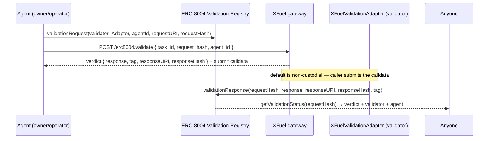

# ERC-8004 Validation Registry — XFuel Integration

> **Status:** Phase 3 of [`TIER3_VERIFIABLE_INFERENCE_BUILD_SPEC.md`](TIER3_VERIFIABLE_INFERENCE_BUILD_SPEC.md)
> (moat #2). Adapter + gateway endpoint + SDK/MCP reads are in; on-chain registry address is
> pinned per deployment. The EIP is still evolving — all coupling is isolated behind
> `contracts/core/XFuelValidationAdapter.sol` so upstream churn never touches XFuel core.

## What this is

[ERC-8004 (Trustless Agents)](https://eips.ethereum.org/EIPS/eip-8004) gives agents on-chain
**identity**, **reputation**, and **validation**. The **Validation Registry** is a request/response
system: an agent (or its operator) opens a request naming a *validator address*; the named
validator answers with a score `0..100` (0 = failed, 100 = passed) plus optional evidence.

**XFuel plugs in as a validator.** An XFuel task already produces a **PBR receipt** binding
*payment + model authenticity (PoMA) + output*. Phase 3 maps that receipt into an ERC-8004
`validationResponse`, so any third party can read an on-chain, XFuel-backed verdict for an agent
task — the exact provenance the ecosystem lacks today.

## Roles & flow



- **Validator identity = the adapter contract.** Agents name `XFuelValidationAdapter` as the
  `validatorAddress`. Only the named validator can answer, so the adapter *is* the XFuel
  validator identity on that chain.
- **Non-custodial by default.** `POST /erc8004/validate` returns the verdict **and ready-to-submit
  calldata**; the agent/operator (or an XFuel relayer holding `SUBMITTER_ROLE`) broadcasts it.
  Set `ERC8004_AUTO_SUBMIT=true` (+ `ERC8004_SUBMITTER_KEY`) to have the gateway push it.
- **Provenance.** The adapter stores `requestHash → taskIdHash` and emits `XFuelValidationSubmitted`,
  so a validation record is always traceable back to the real paid XFuel task.

## Verdict mapping (receipt → score)

Deterministic, shared by the gateway (`services/gateway/src/erc8004.js`) and the SDK
(`receiptToValidationVerdict`):

| Receipt state | `response` | `tag` |
|---|---|---|
| Settled, binding matches (or none), proof valid | `100` | `xfuel:<tier>` (e.g. `xfuel:settlement`) |
| …and binding covers model+output (PBR) | `100` | `xfuel:<tier>+pbr` |
| Payment binding mismatch detected | `0` | `xfuel:binding-mismatch` |
| Proof outcome invalid | `0` | `xfuel:proof-invalid` |
| Not settled / no delivered output | *ineligible (409)* | `xfuel:pending` |

- **`responseURI`** = the public XFuel receipt (`verify_url`) — the evidence.
- **`responseHash`** = `keccak256` of the canonical payment-bound tuple (recomputable by anyone).
- Score stays **binary pass/fail** so any ERC-8004 consumer can gate payment without knowing XFuel
  tiers; the **tag** carries the assurance nuance.

## Gateway API

```bash
POST /erc8004/validate           # auth + rate-limited
X-API-Key: {key}
{ "task_id": "m2m-task-…", "request_hash": "0x…(32 bytes)", "agent_id": "42" }
```

Response:

```json
{
  "validation": { "eligible": true, "response": 100, "tag": "xfuel:settlement+pbr",
                  "response_uri": "https://…/receipt/…", "response_hash": "0x…",
                  "task_id": "…", "task_id_hash": "0x…", "tier": "settlement",
                  "covers": ["payment","settlement","model","inference"] },
  "validator_address": "0xAdapter…",
  "registry_address": "0xRegistry…",
  "adapter_address": "0xAdapter…",
  "submit": { "to": "0xAdapter…", "method": "submitValidation", "args": [ … ], "data": "0x…" },
  "submitted": null
}
```

Returns **409** with `xfuel:pending` when the task isn't settled yet.

## SDK

```ts
import { XFuelOnChain, receiptToValidationVerdict, encodeSubmitValidation } from 'xfuel-sdk/onchain';

// Re-derive the verdict an agent expects XFuel to post (cross-check before trusting):
const verdict = receiptToValidationVerdict(receipt, { requestHash, agentId: 42 });

// Reads (needs erc8004RegistryAddress + provider/rpcUrl):
const chain = new XFuelOnChain({ rpcUrl, erc8004RegistryAddress, xfuelValidationAdapterAddress });
const status = await chain.getValidationStatus(requestHash);       // { response, tag, validator, … }
const summary = await chain.getValidationSummary(42);              // { count, averageResponse }
const prov = await chain.validationProvenance(requestHash);        // { taskIdHash, isAnswered }

// Calldata (validator/relayer submits):
const call = chain.encodeSubmitValidation(verdict);               // via adapter (SUBMITTER_ROLE)
```

## MCP

`get_validation_status` (read-only) — read an on-chain verdict by `requestHash`. Configure the
MCP server with `XFUEL_RPC_URL` + `ERC8004_VALIDATION_REGISTRY`.

## Config

| Env | Purpose |
|---|---|
| `ERC8004_VALIDATION_REGISTRY` | ERC-8004 Validation Registry address |
| `XFUEL_VALIDATION_ADAPTER` | Deployed `XFuelValidationAdapter` (also the default validator address) |
| `XFUEL_VALIDATOR_ADDRESS` | Override validator address if not the adapter |
| `ERC8004_AUTO_SUBMIT` | `true` → gateway pushes the verdict on-chain itself |
| `ERC8004_SUBMITTER_KEY` | Submitter key (only when auto-submit); needs `SUBMITTER_ROLE` |
| `ERC8004_RPC_URL` | RPC for reads/auto-submit (falls back to `BASE_RPC_URL`) |

## Deploy

```bash
# 1. Deploy the adapter (pointing at the ERC-8004 registry on the target chain)
ERC8004_VALIDATION_REGISTRY=0x… npx hardhat run deploy/erc8004-adapter.cjs --network base-sepolia
# 2. Grant SUBMITTER_ROLE to the XFuel relayer key (if auto-submit)
# 3. Agents open validationRequest(validatorAddress = adapter, …) and call POST /erc8004/validate
```

## Security notes

- The adapter never moves funds; it only writes verdicts. `SUBMITTER_ROLE` gates who can post.
- Double-answers are rejected (`AlreadyAnswered`); scores are range-checked (`0..100`).
- Registry address is admin-updatable (`OPERATOR_ROLE`) to absorb ERC-8004 spec/redeploy churn.
