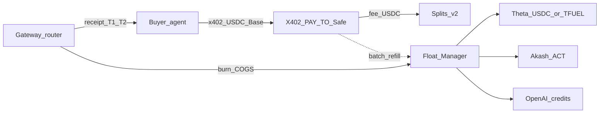

# Provider Float Treasury

Dual-rail money ops: **USDC in from buyers**, **prepaid floats out to providers**. Build-from source for Float Manager and DePIN tiers.

Status: active · Last updated: 2026-08-06  
Related: [STRATEGY.md](./STRATEGY.md) · [adr/0005-provider-float-cogs.md](./adr/0005-provider-float-cogs.md) · [adr/0001-usdc-revenue-and-router-verifier-positioning.md](./adr/0001-usdc-revenue-and-router-verifier-positioning.md) · [LEGAL_LAUNCH_CHECKLIST.md](./LEGAL_LAUNCH_CHECKLIST.md) · [providers/README.md](./providers/README.md)

## Punchline

Buyers settle in USDC via x402 on Base. Providers bill in USDC, TFUEL, ACT/AKT, or USD credits. Do **not** invent per-task atomic FX on the inference hot path. Prefund provider floats, burn COGS at route time, batch-refill from treasury.

Agents never hold TFUEL or AKT to use XFuel.

## Two flows



| Flow | Currency / rail | Where it lands |
|------|-----------------|----------------|
| **Buyer (product)** | USDC / x402 / Base | `X402_PAY_TO` → Safe / Splits v2 |
| **Provider (COGS)** | Prepaid float per provider | EdgeCloud account, Akash ACT escrow, Web2 credits |

Gross buyer USDC ≈ protocol fee + estimated COGS + buffer. Margin = quote − actual COGS − FX/slippage − failed-task waste.

## Per-provider tactics

| Provider | They accept | XFuel tactic | FX pain |
|----------|-------------|--------------|---------|
| Theta EdgeCloud | USDC, TFUEL, TDROP, card/fiat | **Prefer USDC** prepaid on EdgeCloud org; API key in gateway | Low if USDC; medium if TFUEL discount chase |
| Akash | ACT (USD-pegged); AKT burn or card → ACT | Prefund ACT; mark COGS in ACT≈USD | Medium protocol-side; ACT stable for us |
| OpenAI / Web2 | USD card / credits | Collect-and-forward or prepaid credits — **counsel before scale** | Legal high, mechanical low |
| Crypto provider with x402 | USDC | Pass-through / reduce float | None — ideal |
| Bittensor / TAO | TAO / subnet economics | Specialty tier later; or OpenRouter-style bridge initially | High — later phase |

### Theta example (happy path)

1. Prefund EdgeCloud org balance in **USDC** from ops Safe.
2. Buyer pays task quote in USDC via x402 → `X402_PAY_TO`.
3. Gateway routes with `THETA_EDGECLOUD_API_KEY` (or equivalent); burns prepaid COGS.
4. Receipt: `payment_ref` (Base) + `provider` + `provider_cogs` + fee.
5. Nightly: compare float burn vs intake; refill; book margin.

**TFUEL variant (only if required):** Same pattern with a TFUEL wallet float. Refill via batch CEX/DEX from Safe USDC — never on the hot path. Receipt records `cogs` amount + `usd_mark`.

### Akash example

Hold ACT escrow. Quote buyers in USDC. Network pays providers in AKT via protocol mechanics — not your hot path.

## Phases

| Phase | Architecture | Invent? | Done when |
|-------|--------------|---------|-----------|
| **P0** | Manual prepaid floats; USDC quotes with margin; weekly reconcile | No | Paid Base task on Theta and/or Akash tier |
| **P1** | Float Manager v0: balances, low_water; quote gate; receipt `provider_cogs` | **Shipped** — see below | COGS on verify_url / JSON; low-water log warn (external alerts = P2) |
| **P2** | Refill bots / scripted runbooks from Safe | Glue + custody policy | Manual refill not weekly bottleneck |
| **P3** | Pass-through where provider takes x402/USDC | Adapter | Less float for those tiers |

## Receipt fields (P1 — shipped)

Additive COGS block — [RECEIPT_SCHEMA_V2.md](./RECEIPT_SCHEMA_V2.md):

```json
"provider_cogs": {
  "provider": "theta-edgecloud",
  "float_id": "theta-edgecloud",
  "currency": "USDC",
  "estimated": "7000",
  "actual": "7000",
  "usd_mark": "7000",
  "below_low_water": false
}
```

Buyer payment fields stay USDC / x402. Do not mix provider gas into `payment.rail`.

## Float Manager v0 (shipped)

Impl: `services/gateway/src/provider-float.js` (wired in `server.js` `/task-request`, `/task-quote`, `/health`).

Env:

```bash
PROVIDER_FLOATS_JSON={"theta-edgecloud":{"asset":"USDC","balance":"1000000","low_water":"100000","enabled":true}}
PROVIDER_COGS_BPS=7000
PROVIDER_FLOAT_DEFAULT=theta-edgecloud
PROVIDER_FLOAT_ENFORCE=true
# PROVIDER_FLOAT_PUBLIC_BALANCES=true   # ops dashboards only
```

Behavior:

- Quote / task path: reject with `provider_float_exhausted` when enforce + no float covers estimated COGS
- Burn after accept; low-water → structured warn log (Slack/Telegram refill bots = P2)
- No floats configured → unconstrained (demo / P0 manual)

Durable store and refill_policy automation = later.

## Do not build

- Per-task atomic bridge/swap USDC → TFUEL/AKT before inference returns
- Buyer-facing quotes in TFUEL or AKT
- On-chain TFUEL escrow per task as settlement home
- Commingling buyer USDC and float COGS without double-entry books

## Legal / risk

| Mode | Risk | Mitigation |
|------|------|------------|
| Prepaid float (accounts XFuel owns) | Inventory / FX | Caps, alerts, Safe policies; books: revenue vs COGS |
| Crypto pass-through (provider takes USDC/x402) | Lower custody complexity | Prefer when available |
| Web2 collect-and-forward | Money-transmission | [LEGAL_LAUNCH_CHECKLIST.md](./LEGAL_LAUNCH_CHECKLIST.md) before scale |

ADR 0001: pass-through for crypto-native providers; collect-and-forward for Web2 after counsel.

## Ops checklist (P0)

- [ ] EdgeCloud org: USDC prepaid + API key on gateway host
- [ ] Optional TFUEL wallet documented (only if used)
- [ ] Akash ACT path documented when enabling Akash tier
- [ ] Quote margin covers COGS + buffer
- [ ] Weekly reconcile: x402 intake vs float burn
- [ ] Counsel engaged before scaling Web2 pass-through revenue
