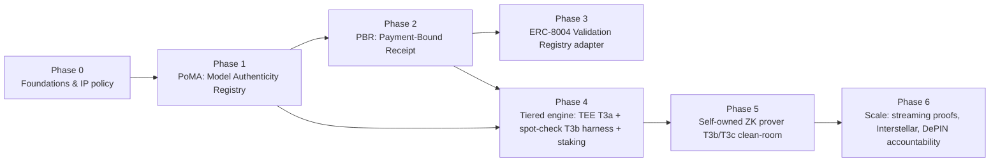

# XFuel Tier-3 — Verifiable Inference Build Spec & Pipeline

> **Status:** Actionable build spec (planning). Turns the strategy in
> [`research/tier3-verifiable-inference-strategy.md`](./research/tier3-verifiable-inference-strategy.md)
> and the feasibility call in
> [`research/zkGPT-tier3-unblock-decision.md`](./research/zkGPT-tier3-unblock-decision.md)
> into a phased, ship-in-pieces roadmap.
> **Date:** 2026-07-17
> **Owns:** the buildable definition of XFuel Tier-3 (proof-of-inference).
> **Principle:** build our own, clean-room, from permissive primitives; headline value
> = **anti-downgrade + payment-bound verifiable receipt**, delivered as a **hybrid
> tiered** layer — not a race to out-prove DeepProve on raw zkML.

---

## 0. Product framing (names + the story)

**Product:** **XFuel Verified Inference (VI)** — the settlement-native, payment-bound
proof-of-inference layer for AI agents. Tier-3 of XFuel's trust ladder.

**Core primitives (what we're actually building):**
- **PoMA — Proof of Model Authenticity.** A commitment to the exact weight file used +
  a (cheap) proof/attestation that *that* model produced the output. Directly defeats
  the **Model Downgrade Attack**. This is the wedge, not full-forward-pass ZK.
- **PBR — Payment-Bound Receipt.** The verifiable receipt binds `model_commitment +
  input_hash + output_hash + x402 payment_ref` so **payment settles iff the right
  model ran**. XFuel-unique; composes with x402/ERC-8183.
- **Tiered Tier-3 mechanisms** (choose per value-at-risk, like ERC-8004 intends):
  - **T3a — TEE attestation** (fast path; NVIDIA H100 confidential computing).
  - **T3b — Stochastic ZK spot-check** (self-owned prover; random layers/tokens/reqs).
  - **T3c — Full zkML proof** (premium/high-assurance; small–mid models).
  - Backed by **staking/slashing** economics.

**The story (one paragraph):** *Today agents pay for AI with no proof they got the
model they paid for — 98–100% of on-chain agent reputation has no verifiable
provenance, and ERC-8004's Validation Registry has no mainnet deployment. XFuel Verified
Inference issues a payment-bound receipt proving the exact model ran on the exact input,
verifiable on Base in milliseconds, with trust tiered to the value at risk — TEE-fast by
default, cryptographically spot-checked, economically slashed. It's the missing receipt
for the agent economy.*

**Model-story tie-in (XFuel trust ladder):**
`T1 signed receipt (live) → T2 SP1 settlement proof (live) → T3 Verified Inference (this spec)`.

---

## 1. The 5 moats → where they land in the pipeline

| # | Moat | Primary phase(s) | Shippable without heavy ZK? |
|---|------|------------------|------------------------------|
| 1 | Settlement-native + **payment-bound** | Phase 2 (PBR) | ✅ Yes |
| 2 | **ERC-8004 Validation Registry** backend (first mainnet) | Phase 3 | ✅ Yes |
| 3 | **Tiered hybrid** trust (TEE + ZK spot-check + staking) | Phase 4 | ✅ (TEE+staking first) |
| 4 | **Self-owned permissive prover** | Phase 5 | ⛔ the crypto build |
| 5 | **DePIN/Theta-native + Interstellar** collaborative proving | Phase 6 | ⛔ scale |

**Key insight for sequencing:** moats 1–3 (highest market pull, ERC-8004 gap) ship
**before** the hard cryptography (moat 4). We start earning the "verifiable provenance"
story with commitments + TEE + payment binding, then harden with our own ZK prover.

---

## 2. Build pipeline at a glance

- **Critical path to a real, honest demo:** P0 → P1 → P2 (→ P4 T3a). That's anti-downgrade
  + payment-bound + TEE-fast — demoable without waiting on the ZK build.
- **Parallelizable:** P3 (registry adapter) can run alongside P4; P5 crypto R&D can
  start spiking during P1–P4.

---

## 3. Phase 0 — Foundations, interfaces & IP policy (easiest / do first) — ✅ SHIPPED

> ADR `docs/adr/0003-verified-inference-cleanroom.md`, `docs/verified-inference/PROVENANCE_LOG.md`,
> `contracts/interfaces/IVerifiedInference.sol`, and `services/gateway/src/inference-prover-client.js`
> (with `INFERENCE_PROVER_URL`) are in. No runtime behavior change.

**Goal:** lock the seams and the clean-room rules so every later phase snaps in.

**Actionable items**
- [ ] **Permissive-only dependency policy.** Approved: `arkworks-rs/sumcheck` (Apache+MIT),
      `scroll-tech/ceno` (Apache-2.0), `scroll-tech/gkr-backend`, Plonky3, Jolt/Lasso,
      `mcl`. **Forbidden in product path:** Lagrange `zkml` crate, Polyhedra Expander/ECC
      (AGPL). Add `docs/adr/000X-verified-inference-cleanroom.md`.
- [ ] **Provenance log** template (paper/idea → permissive dep) for auditor + IP hygiene.
- [ ] **Rename the seam:** generalize gateway's `ZKGPT_PROVER_URL` client →
      `INFERENCE_PROVER_URL` (mechanism-agnostic: mock | tee | zk-spotcheck | zk-full).
      Touch: `services/gateway/src/zkgpt-prover-client.js` (→ `inference-prover-client.js`).
- [ ] **Verifier seam:** generalize `contracts/core/ZKVerifierZkGPT.sol` /
      `IZKVerifierZkGPT.sol` → `IVerifiedInference` with `verify(kind, publicValues, proof, nullifier)`.
- [ ] **Receipt schema v2 draft** (see Phase 2) reviewed against `docs/M2M_API.md`.

**Exit criteria:** ADR merged; interfaces named; no code behavior change yet.
**Effort:** S. **Risk:** low. **Story:** internal enabler.

---

## 4. Phase 1 — PoMA: Model Authenticity Registry (critical wedge, low ZK) — ✅ SHIPPED

> `contracts/core/ModelRegistry.sol` (+ `IModelRegistry`, tests, `deploy/model-registry.cjs`),
> commitment tooling `services/gateway/src/model-commitment.js`, receipt stamping of
> `route.model_commitment`, SDK PoMA helpers + reads, and MCP `verify_model_commitment` are in.
> `docs/POMA_SPEC.md` documents the scheme. One-command provider onboarding:
> `deploy/register-model.cjs`.

**Goal:** make "prove the model you paid for" real **without** the full ZK prover — the
anti-downgrade primitive that is the actual market need.

**Design**
- **Model commitment:** at registration, compute a commitment to the exact weights
  (start: keccak/Merkle over quantized weight shards; upgrade path: MLE/polynomial
  commitment reusable by the ZK tier). Store `model_id → commitment, arch, quant, meta`.
- **On-chain registry:** `ModelRegistry` contract on Base: `registerModel(commitment, meta)`,
  `getModel(modelId)`; emits `ModelRegistered`. Immutable commitments; versioned.
- **Serving binding:** the inference path records `model_commitment` used and includes it
  in the receipt (Phase 2 binds it to payment). Fast checks first (attested/self-declared),
  cryptographic checks added in Phase 4/5.

**Actionable items**
- [ ] `contracts/core/ModelRegistry.sol` (+ interface, tests, deploy script + manifest).
- [ ] Weight-commitment tool (`services/gateway` or `packages/`) producing a commitment
      from ONNX/GGUF/safetensors shards (formats agents actually ship — match DeepProve's
      lesson).
- [ ] Gateway: attach `model_commitment` to task processing + receipt.
- [ ] `docs/POMA_SPEC.md` — commitment scheme, upgrade path to MLE commitment.
- [ ] SDK/MCP: `get_model`/`verify_model_commitment` helper.

**Exit criteria:** a task returns a receipt carrying a registered `model_commitment`;
mismatch is detectable.
**Effort:** M. **Risk:** low–med (commitment scheme choice). **Moat:** #1 foundation.
**Story:** *"XFuel commits every served model on-chain — downgrade attacks become
detectable."*

---

## 5. Phase 2 — PBR: Payment-Bound Receipt v2 (moat #1)

**Goal:** bind proof/attestation to the x402 payment so **money releases iff the right
model produced the output**.

**Design**
- Extend public values / receipt to commit:
  `(taskId, model_commitment, input_hash, output_hash, payment_ref, fee, nonce)`.
- Reuse existing **`X402_PROOF_BINDING`** flag + `SP1ProofHooks` public-values v2 layout
  (the 13th `paymentCommitment` field already scoped in AGENTS/RUNTIME_STATE) — extend it
  to also carry `model_commitment` + `output_hash`.
- Receipt signed (T1 path) now; upgradeable to in-proof binding when the prover ships.

> **Status: ✅ SHIPPED (core).** Superset commitment
> `SP1ProofHooks.computeInferenceBindingCommitment` + JS/SDK mirrors (`computeInferenceBinding`,
> all three parity-tested), PBR-aware `receipt.js` (`binding.covers`, `proof.tier`, optional
> Tier-1 HMAC `signature` gated by `RECEIPT_SIGNING_SECRET`), SDK `verifyReceiptSignature`, docs
> (`M2M_API.md`, `RECEIPT_SCHEMA_V2.md`, `ZKG2_VERIFIER_SPEC.md`), and agent tooling
> (`get_verified_quote`) are in. In-proof activation waits on the SP1 guest v2 rebuild.

**Actionable items**
- [x] Define the binding over `(paymentRef, taskId, rail, amount, modelCommitment, outputHash)` in
      `SP1ProofHooks` NatSpec + `docs/ZKG2_VERIFIER_SPEC.md` update. (`outputHash` already in v2
      public values; model binding folds into the v2 `paymentCommitment` field.)
- [x] Gateway `receipt.js`: emit PBR fields (`binding.covers`, `proof.tier`); HMAC/signature over
      the bound tuple.
- [x] x402 flow: `payment_ref` is threaded into the binding + receipt (behind `X402_PROOF_BINDING`).
- [x] `docs/M2M_API.md`: document PBR fields + signature.
- [x] Tests: payment_ref ↔ receipt binding; tamper detection; JS↔Solidity↔SDK parity.

**Exit criteria:** a paid task returns a receipt cryptographically binding model + I/O +
payment; verifier can reject a mismatched pairing. ✅
**Effort:** M. **Risk:** med (touches settlement path — kept behind flag). **Moat:** #1.
**Story:** *"Pay-for-correct-inference, atomic. The receipt ERC-8183/x402 assume exists."*

---

## 6. Phase 3 — ERC-8004 Validation Registry adapter (moat #2, first-mover) — ✅ SHIPPED

> Pinned interface `contracts/interfaces/IERC8004ValidationRegistry.sol`, on-chain validator
> identity `contracts/core/XFuelValidationAdapter.sol` (+ mock + tests + `deploy/erc8004-adapter.cjs`),
> gateway verdict builder `services/gateway/src/erc8004.js` + `POST /erc8004/validate`
> (non-custodial calldata by default, optional auto-submit), SDK reads/encoders
> (`receiptToValidationVerdict`, `getValidationStatus`, `encodeSubmitValidation`), MCP
> `get_validation_status`, and `docs/ERC8004_INTEGRATION.md` are in.

**Goal:** expose XFuel PBRs/proofs as ERC-8004 **validation records** — be the first
mainnet verifiable-provenance validator the agent stack plugs into.

**Design**
- Adapter that writes `(validator=XFuel, agent, taskId) → verdict{0,1}` to the ERC-8004
  Validation Registry, referencing the PBR + proof kind (T3a/b/c).
- Map XFuel task provenance (payment proof + task linkage) to the exact gap the ecosystem
  lacks (98–100% of records have neither today).

**Actionable items**
- [x] Track ERC-8004 Validation Registry interface (pinned July 2026 in
      `IERC8004ValidationRegistry.sol`; isolated behind the adapter for spec churn).
- [x] `services/gateway` endpoint: `POST /erc8004/validate` → returns validation record + calldata.
- [x] Contract shim on Base bridging XFuel receipts → registry verdicts (`XFuelValidationAdapter`).
- [x] `docs/ERC8004_INTEGRATION.md`.
- [x] Demo path: agent task → XFuel PBR → on-chain validation record queryable via
      `getValidationStatus` / MCP `get_validation_status`.

**Exit criteria:** a third party can read an XFuel-produced validation record tied to a
real payment + task.
**Effort:** M. **Risk:** med (standard flux — isolate behind adapter). **Moat:** #2.
**Story:** *"XFuel is the trust/validation backend for ERC-8004 agents — live where
nobody else is."*

---

## 7. Phase 4 — Tiered engine: TEE (T3a) + spot-check harness (T3b) + staking

> **Status: ✅ SHIPPED (software).** Tier selector (`services/gateway/src/tier-policy.js`,
> pure + SDK mirror), pluggable TEE attestation verifier (`tee-attestation.js` — real
> secp256k1 `dev` attestor now; vendor slots via `registerAttestor`), verifiable spot-check
> sampler (`spotcheck.js`), and `contracts/core/ProviderStaking.sol` (stake / cooldown-unstake /
> slash → treasury / freeze / reputation; `IProviderStaking` + `ProviderSlashed`) with 15
> passing Hardhat tests. Receipts gained a `verified_inference` block + tier-driven `proof.tier`
> (config-gated, off by default → JSON unchanged). `POST /task-request` accepts `proof_tier`.
> SDK: `selectTier` mirror + `ProviderStaking` reads/encoders (72 tests). MCP: `get_provider_stake`
> (12 tools, 30 tests). Docs: [`VERIFIED_INFERENCE_TIERS.md`](VERIFIED_INFERENCE_TIERS.md).
> Deploy: `deploy/provider-staking.cjs`. **Only remaining dependency: source an H100-CC host to
> wire a hardware attestor** (the `dev` attestor is honestly labeled `trust: "software"` until then).

**Goal:** the hybrid trust engine — ship the **fast TEE path** and the
**mechanism-agnostic spot-check + staking** economics *before* the ZK prover exists.

**Design**
- **Tier selector:** per task/value-at-risk choose `T3a | T3b | T3c` (config + policy).
- **T3a TEE:** integrate NVIDIA H100 confidential-computing attestation → verify quote,
  pin MRENCLAVE/model-root policy, bind to PBR. Sub-second, production-scale.
- **T3b harness (mechanism-agnostic):** sample a tunable fraction of tasks for a deeper
  check; initially the "check" can be **re-execution / attestation compare**, later the
  self-owned ZK proof (Phase 5) drops in with no API change.
- **Staking/slashing:** provider stake; failed spot-check → slash + reputation hit (wire
  to `A2ACircuit`/ProviderSlashed pattern already discussed in the pipeline).

**Actionable items**
- [x] Tier-selection policy + config in gateway; `proof_tier` in task request; SDK `selectTier` mirror.
- [x] T3a: TEE attestation verifier module + policy (pluggable; `dev` secp256k1 attestor). *(Source an H100-CC host to wire a hardware attestor — only external dependency left.)*
- [x] T3b: verifiable sampling + dispute record; `ProviderSlashed` event path.
- [x] Staking contract (`ProviderStaking.sol` + `IProviderStaking`); slashing hook + `MockERC20` tests.
- [x] `docs/VERIFIED_INFERENCE_TIERS.md` (tier semantics + when each applies).
- [x] Surface: receipt `verified_inference` block, MCP `get_provider_stake`, deploy script.

**Exit criteria:** a task can be served with a TEE-attested, payment-bound receipt; a
sampled task triggers a deeper check + slashing on mismatch.
**Effort:** L. **Risk:** med–high (TEE hardware/vendor; economics). **Moat:** #3.
**Story:** *"Trust tiered to value at risk: TEE-fast by default, spot-checked, slashed."*

---

## 8. Phase 5 — XFuel zkLLM: self-owned, model-agnostic ZK prover (moat #4, the crypto build)

> **Naming:** not "zkGPT" (GPT-specific undersells it). This is **XFuel zkLLM** — the
> Verified-Inference prover — built **op-first + config-driven** so one codebase captures the
> whole *ZK-addressable* LLM market (open-weight decoder transformers: Llama, Mistral, Qwen,
> Gemma, GPT-2, MoE variants). Closed models (GPT-4o/Claude/Gemini) can't be ZK-proven by
> anyone — no weight access — and are honestly covered by the **T3a TEE** / signed tiers.

**Goal:** our own, permissively-built ZK prover for T3b/T3c — the tier we **own outright**.
Clean-room from papers + Apache/MIT primitives (`arkworks`; **not** AGPL/`zkml`-encumbered stacks).

**Key design principle — model-agnostic by construction**
- **Matmul is ~90%+ of the cost and is architecture-independent** (only dims change). Build the
  generic sumcheck/GKR matmul proof **once** → it works for every transformer LLM on day one.
- Architecture differences are a small **long tail of pluggable gadgets** selected by a
  **model manifest** (`family, n_layers, d_model, n_heads, n_kv_heads, d_ff, norm, act, pos, quant`):
  RMSNorm↔LayerNorm, SwiGLU/SiLU↔GeLU, RoPE↔learned-pos, GQA↔MHA. New model = config, not circuit.
- **Quantized-integer inference** (e.g. `llama-3:q4_k_m`) is both the DePIN market reality **and**
  ZK-friendly (finite-field native; floats need costly fixed-point emulation). Target it first.
- **Spot-check = one block.** T3b proves a *random block window*, and every transformer block is
  structurally identical, so **one block prover + the manifest = any depth, any model.** No
  whole-model RAM needed to have a real, verifiable product.

**Design (smallest → up)**
- **M5.1 Generic matmul argument** (sumcheck/GKR, Fiat-Shamir) — the architecture-agnostic core;
  + model manifest & **arch-bound PoMA commitment** + PBR public-input binding. *(✅ shipped)*
- **M5.2 One transformer block** — compose matmul core with Llama-family gadgets (RMSNorm →
  SwiGLU/SiLU via Lasso/logup lookups → RoPE → GQA assembly). GPT-2-style falls out as a subset.
  *(← M5.2a shipped: Hadamard gadget + SwiGLU FFN; M5.2b shipped: logup lookup + quantized
  activation (SiLU/GeLU) + **RMSNorm** + **causal self-attention** (softmax via exp+reciprocal
  lookups) + a full **transformer block**; M5.2b-cont shipped: **multi-head + GQA** attention +
  **RoPE** (public-linear) — FFN and multi-head attention each reach **zero pending obligations**;
  M5.3 shipped the inter-op **requantization** gadget (division-with-remainder + range checks))*
- **M5.3 Small-model spot-check** (TinyLlama/GPT-2-class): inter-op **requantization range-checks**
  (shipped) so each op re-enters the next op's code domain; then prove a random block window against
  the committed weights+arch (PoMA), not the whole pass; bench time/RAM on the high-RAM CPU host.
- **M5.4 On-chain verify:** Solidity/Yul (BN254 precompiles) or Groth16 wrapper → `ZKVerifierSP1`;
  nullifier + settlement.
- **M5.5 (premium) full-pass** for small–mid models (T3c).

**Actionable items**
- [x] **M5.1** Prover crate skeleton (Rust workspace `services/zkllm-prover`, crate `xfuel-zkp`) on
      approved deps; provenance log per component (ADR 0004). Generic sumcheck matmul argument +
      Keccak256 Fiat–Shamir transcript. 9 `cargo test` green (soundness + tamper + keccak parity);
      `--example prove_block` bench harness + Dockerfile.
- [x] Model **manifest** + **arch-bound PoMA** commitment; proof public-input **PBR binding**
      byte-identical to `SP1ProofHooks.computeInferenceBindingCommitment` (keccak known-answer tested;
      full Rust↔JS vector parity harness tracked for M5.4).
- [~] **M5.2** In progress. **M5.2a + M5.2b (activation + norm) shipped.**
      - **M5.2a** — gadget layer + first block composition:
        - Generic **multi-product (degree-d) sumcheck** + Lagrange evaluation (`sumcheck.rs`).
        - Sound **Hadamard (elementwise-product) argument** `z = a⊙b` — the SwiGLU/RoPE workhorse —
          via a degree-3 `Σ_x eq(r,x)·a(x)·b(x)` reduction (`gadgets.rs`).
        - **SwiGLU FFN sub-block** (`ffn.rs`): `norm → Wgate/Wup → SiLU → gate(⊙) → Wdown → residual`,
          composing **3 matmul proofs + the gating Hadamard proof under one Fiat–Shamir transcript**,
          manifest-driven (`FfnConfig::from_manifest`; GPT-2 GeLU-FFN is a config subset).
      - **M5.2b (activation)** — the transcendental steps are now **soundly proven**, not trusted:
        - **Logup lookup argument** (`lookup.rs`, Habök-style): folds columns with `γ`, proves the
          `Σ 1/(β−q) = Σ m/(β−τ)` identity via two triple-product zero-check sumchecks. Discharges
          any `code → out` non-linearity (SiLU/GeLU/softmax-exp/rsqrt) with no field-native circuit.
        - **Quantized activation table** (`activation.rs`): builds the fixed-point SiLU/GeLU table and
          proves `act = f(gate)` by lookup. Wired into the FFN — in quantized mode the `silu`/`gelu`
          obligation is **discharged**.
        - **RMSNorm gadget** (`norm.rs`): `y = x·inv_rms·w` proven soundly by composing existing
          tools — `xsq = x⊙x` (Hadamard), `ss = Σ_j xsq` (linear row-reduction, checked directly),
          `inv_rms = rsqrt_table(ss)` (**canonical logup lookup** — the sound choice; an exact
          in-field `inv_rms²·(ss/d+eps)=1` constraint is *unsatisfiable* for a rounded fixed-point
          `inv_rms`), then `x⊙inv_rms⊙w` (two Hadamards). Wired into the FFN — a quantized SwiGLU FFN
          block now has **zero pending obligations**.
        - **Generic lookup table** (`table.rs`, `ScalarTable`): the reusable `code→code` backbone for
          any quantized non-linearity (activation/rsqrt predate it and can migrate onto it).
        - **Causal self-attention** (`attention.rs`): pre-norm single-head — Q/K/V/O projections +
          `S=Q·Kᵀ` + `Ctx=P·V` (matmul), causal mask (public sentinel), and **softmax** as `exp` +
          row-sum + **reciprocal** logup lookups + a normalization Hadamard. Quantized single-head
          attention reaches **zero pending obligations**. RoPE (public-linear) and multi-head/GQA
          (witness assembly) are the documented follow-ups; the argument set is complete.
        - **Full transformer block** (`block.rs`): composes `attention → ffn` under one transcript.
        - **RoPE** (`rope.rs`): public-linear (fixed-point cos/sin) exact rotation of Q/K — verifier
          recomputes, no proof object, no rounding hazard.
        - **Multi-head + GQA attention** (`mha.rs`): one shared norm + Q/K/V/O projections, RoPE on
          Q/K, and the per-head softmax argument for every head under one transcript; GQA is index
          layout (`head → kv group`). **Zero pending obligations** (quantized). This closes the
          M5.2b-cont assembly — the transformer block is now full-width, not just single-head.
      - **111 `cargo test` green** (matmul **10** (adds committed succinct-verify / wrong-weight-commit /
        forged-final-eval / **commitment-bound challenge** / **I/O-committed 2-matmul chain** /
        **tampered-intermediate composition reject**) + commitments 5 + **residual 4** (committed add:
        honest / wrong-sum / forged-opening / wrong-commit) + hadamard/gadgets **10** (committed verify /
        wrong-operand-commit / forged-final-eval + I/O-committed verify / tampered-output-commit /
        **matmul-output→hadamard-operand cross-op composition**) + **lookup 8** (adds committed
        succinct-verify / forged-Σa=Σb-sum / forged-opening / wrong-advice-commit) + **activation
        3** + **reduce 4** (committed row-sum: honest / wrong-sum / forged-opening / wrong-commit) +
        **norm 10** (adds committed RMSNorm: honest succinct verify / wrong-output-commit /
        **forged-table tie** / forged-scaling-opening) + **attention 6** + **softmax 5** (committed
        causal softmax: honest / wrong-output-commit / **forged-exp-table** / forged-scaling-opening /
        tampered-masked-commit) + **block 2** + **rope 4** +
        **mha 7** + **range 4** +
        **requant 7** (honest / tampered q,r / out-of-range decomposition / wrong divisor / **signed
        accumulator + bias** / requant→activation-lookup integration) + **FFN 12** (adds wide-gate→
        requant→activation zero-obligation + requant mode-mismatch) + **spotcheck 5** + **pcs 5**
        (convention-match vs `mle_eval` / round-trip / wrong-value / wrong-point / tampered-commitment));
        `--example prove_ffn` harness (64×512×1024: prove ~4.4s, verify ~0.34s, CPU-only).
- [~] **M5.3** In progress. **Requant wired into the block + spot-check orchestration shipped:**
      - **Range-check gadget** (`range.rs`): proves a column ∈ `[0, bound)` as a membership lookup
        into the identity table — the reusable backbone for requant bounds and limb decompositions.
      - **Inter-op requantization** (`requant.rs`): proves `acc + bias = q·D + r` with `0 ≤ r < D` and
        `0 ≤ q < q_bound` (division-with-remainder + two range checks; `D=2^shift` public, so the
        identity is checked directly). Uniquely determines `q = ⌊acc/D⌋`, bounds output into the next
        op's code domain, and forces `acc < q_bound·D` (no silent overflow). Signed accumulators are
        handled by the public `bias` (`acc + bias ≥ 0`), byte-checked in the identity.
      - **Requant wired into the FFN gate path** (`ffn.rs` `RequantParams`): a wide `gate = xn·Wgate`
        accumulator is requantized into the activation's code domain under the block transcript, and
        the activation lookup runs on the quotient. An FFN test proves wide-gate → requant →
        activation → sound RMSNorm with **zero pending obligations**; it threads through `prove_block`.
      - **Tier-3b block-window spot-check** (`spotcheck.rs`): a Fiat–Shamir-selected pseudo-random
        window of `k` blocks bound to the model + PBR commitments (prover can't cherry-pick; any trace
        tampering re-rolls the selection). Generic over the per-block prover; tests cover determinism,
        binding-sensitivity, honest verify, tampered-output rejection, and cherry-pick rejection.
      - **Remaining:** bench time/RAM on the high-RAM CPU host (256–512 GB, **not GPU** — per the RAM
        reframing). Fill `docs/ZKG5_BENCHMARK.md`.
- [~] **M5.4** In progress. **M5.4a (PCS binding for the matmul core, Hadamard gate, and logup lookup) shipped.**
      - **PCS module** (`pcs.rs`): a thin wrapper over `ark_poly_commit::multilinear_pc::MultilinearPC`
        — **multilinear KZG** (Papamanthou–Shi–Tamassia) over BN254. `setup` (trusted powers-of-tau,
        off the hot path) → `keys` (trim per `num_vars`) → `commit`/`open`/`verify`. Bridges our
        MSB-first MLE point convention to ark-poly's LSB-first order (reverse-point), pinned by a
        convention-match test asserting a PCS opening reproduces `mle::mle_eval` exactly.
      - **Matmul made succinct** (`matmul.rs` `prove_committed`/`verify_committed`): the two final MLE
        evaluations `f(r)=Â(rx,r)`, `g(r)=B̂(r,ry)` — previously recomputed from the full tensors — are
        now discharged by PCS openings against commitments to `A`,`B`. The verifier holds only `C` +
        the commitments (the weight commitment `B` is the PoMA anchor). Tests: honest succinct verify
        (incl. rectangular A/B of different MLE widths), wrong-weight-commitment rejection, forged
        final-evaluation rejection. **Rationale for multilinear KZG:** pairing-based on BN254 ⇒ an
        opening verifies with the `ecPairing` precompile, keeping the on-chain verifier native-Solidity
        (see ADR 0004 provenance note).
      - **Hadamard made succinct** (`gadgets.rs` `prove_committed_hadamard`/`verify_committed_hadamard`):
        the SwiGLU gate's `a(ch)`, `b(ch)` are bound to PCS commitments of `a`,`b`; the verifier holds
        only `z`. Tests: honest verify from commitments, wrong-operand-commitment rejection, forged
        final-evaluation rejection.
      - **Lookup made succinct** (`lookup.rs` `prove_committed_lookup`/`verify_committed_lookup`): the
        logup grand-sum `Σa=Σb` is turned into **two single-factor sumchecks** (each reduces a sum to one
        committed evaluation, and both must reduce the *same* claimed sum — that's where `Σa=Σb` is
        enforced); every query/table column plus the `m`,`a`,`b` advice is PCS-committed, and the ~11 MLE
        evaluations the M5.2b verifier recomputed become PCS openings at transcript-derived points. The
        verifier holds only commitments. Tests: honest succinct verify (incl. rectangular n≠t), forged
        `Σa=Σb` sum rejection, forged opening-value rejection, wrong-advice-commitment rejection.
      - **Fiat–Shamir soundness (committed paths):** the committed transcripts absorb the operand
        commitments **before** drawing any challenge (`bind_and_draw_committed`, `bind_hadamard_committed`,
        `bind_committed` for lookup, `bind_and_draw_io` for the composition primitive, via
        `pcs::commitment_bytes`), so a prover can't fix the witness after seeing the "random" points
        (adaptive-witness attack). Guarded by a dedicated matmul test.
      - **Composition primitives** (M5.4b): each op commits+opens its *output* so the verifier holds
        **no tensors** and ops link by commitment reuse (PCS binding forces the same polynomial across
        the seam — no separate linking argument).
        - `matmul.rs` `prove_committed_io`/`verify_committed_io`: the output claim `Ĉ(rx,ry)` becomes a
          PCS opening (not a `c_hat` recompute). Test: 2-matmul chain `Z=(A·B)·D` verified from
          commitments alone + tampered-intermediate rejection.
        - `gadgets.rs` `prove_committed_hadamard_io`/`verify_committed_hadamard_io`: also commits+opens
          the gate output `z`. Test: a **cross-op** seam — a matmul output feeds a Hadamard operand by
          commitment reuse, verifier materializes nothing.
        - `residual.rs` `prove_committed_add`/`verify_committed_add`: `out = x + sub` as a linear
          (Schwartz–Zippel) one-point + three-opening check — the block's two residual seams.
        - `reduce.rs` `prove_committed_rowsum`/`verify_committed_rowsum`: `narrow[r] = Σ_j wide[r,j]`
          via a 2-product sumcheck against a broadcast `eq` (the broadcast operand needs no opening).
        - `norm.rs` `prove_committed_rmsnorm`/`verify_committed_rmsnorm`: the first **assembled**
          committed sub-block — hadamard-io (`xsq`) → committed row-sum (`ss`) → committed lookup
          (`inv=rsqrt(ss)`) → a fused 4-product scaling sumcheck (`y = x·inv[r]·w[j]`, no broadcast
          tensors for the verifier). Ops linked by commitment reuse; the lookup's table tied to the
          canonical `rsqrt` table (anti-forged-table). `w` public for now (PoMA-commit is the last
          weight-binding step).
        - `pcs.rs` gains a canonical `Opening`/`open_at`/`check_open` (lookup refactored onto it).
        - `softmax.rs` `prove_committed_softmax`/`verify_committed_softmax`: the committed **causal
          softmax** — attention's nonlinear core, from committed `S` to committed `P`. Composes mask
          hadamard-io + `exp`/reciprocal committed lookups + committed row-sum + a fused row-scale
          sumcheck, threaded by commitment reuse; the causal mask and both tables are tied to their
          canonical forms (`ScalarTable::{prove,verify}_committed` centralize the table-tie).
        Total `cargo test`: **111** (+38 over M5.3).
      - **Remaining (M5.4b):** the rest of a committed **attention** (projections/scores via matmul-io
        with a transposed `Kᵀ` opening, context/output, residual), then assemble the fully-succinct
        `block`; then the on-chain verifier + settlement E2E below.
- [ ] **M5.4b** Implement `IVerifiedInference` verifier (Option A native Solidity via BN254
      precompiles: KZG opening + sumcheck; Groth16 wrap optional for gas); gas bench.
- [ ] E2E: task → spot-check proof → on-chain verify → settle.

**Exit criteria:** a real (non-mock) spot-check proof verifies on Base and gates settlement.
**Effort:** XL. **Risk:** high (specialist crypto + time). **Moat:** #4.
**Deploy note:** CPU-only Rust — runs in any container (Dockerfile shipped with the crate). Model-
scale steps (M5.3+) need a **high-RAM host** (AWS `r7i`/`x2iedn` or a large-memory Fargate task).
**Story:** *"XFuel zkLLM — our own cryptographic proof of model authenticity, model-agnostic and owned."*

---

## 9. Phase 6 — Scale: streaming proofs, Interstellar, DePIN accountability (moat #5)

**Goal:** scale coverage + differentiate on Theta/DePIN.

**Actionable items**
- [ ] **Streaming/per-token proofs** (dynamic zk-SNARK ideas) so cost tracks tokens.
- [ ] **Interstellar** GKR folding for prover speedup + **collaborative folding** for
      swarm proofs (engage Theta Labs; `SP1_PROVER=interstellar`-style backend).
- [ ] **DePIN accountability** (Cirrus 2024/1873): identify + slash faulty provider across
      EdgeCloud/Akash; hierarchical aggregation for batch settlement.
- [ ] Larger models via distributed proving (Hekaton/Cirrus) as demand appears.
- [ ] **State Space Models (Mamba / S4 / S6) — coverage extension (research track).** Modern SSMs
      decompose into the *same* op vocabulary the prover already owns: input/selective-parameter
      projections + gating are **matmul + Hadamard**; `Δ`'s `softplus`/`exp` is the **same logup
      lookup** as activation/softmax. The one net-new primitive is the **selective scan** — a linear
      recurrence `h_t = Ā_t·h_{t-1} + B̄_t·x_t` with *diagonal* state — which is an **associative
      (prefix) scan**, provable as per-step local-consistency + boundary (sumcheck/lookup-shaped), not
      an O(n) sequential circuit. This is a `scan.rs` gadget + a manifest arch entry (**new model =
      config + one gadget**), *not* a rewrite. Strategic value: (1) extends coverage to Mamba +
      **hybrid** models (Jamba/Zamba/Falcon-Mamba, which also need the transformer block), (2) is
      arguably *more* ZK-friendly than attention (linear recurrence, no O(n²) softmax), (3) reinforces
      the model-agnostic ("not zkGPT") wedge. Caveat: recurrent state compounds quantization error, so
      the M5.3 requantization range-checks matter more here. Market note: still transformer-dominated,
      so this follows — not precedes — the transformer block.

**Exit criteria:** a swarm/DePIN task produces one verifiable proof with provider
accountability.
**Effort:** XL. **Risk:** high / research-dependent. **Moat:** #5.
**Story:** *"Verifiable inference across the DePIN GPU network — swarm-scale, accountable."*

---

## 10. Recommended execution order (build-in-pieces)

**Wave A — ship the story without heavy ZK (weeks, high market pull):**
1. Phase 0 (foundations) → 2. Phase 1 (PoMA registry) → 3. Phase 2 (PBR).
   → *Demoable: payment-bound, model-committed receipt = anti-downgrade v1.*

**Wave B — become the agent trust backend (parallelizable):**
4. Phase 3 (ERC-8004 adapter) ‖ 5. Phase 4 T3a (TEE) + staking harness.
   → *Demoable: first mainnet Validation Registry records, TEE-fast verified inference.*

**Wave C — own the cryptography:**
6. Phase 5 (self-owned ZK spot-check, small model) drops into the Phase 4 harness.

**Wave D — scale/differentiate:**
7. Phase 6 (streaming, Interstellar, DePIN accountability).

> **Rule (from the research pipeline):** one proof-system migration at a time; don't
> parallelize multiple prover/circuit changes in the same sprint.

---

## 11. How this plugs into the existing project

- **Trust ladder:** extends T1/T2 (live) with T3a/b/c — update `docs/RUNTIME_STATE.md`
  (reclassify Tier-3 from "GPU-blocked" → "Verified Inference build, RAM-not-GPU").
- **Whitepaper:** add a "Verified Inference (Tier-3)" section near §12 research track;
  cite the strategy + this spec.
- **Contracts:** `ModelRegistry`, `IVerifiedInference`/`ZKVerifierZkGPT`→generalized,
  `SP1ProofHooks` PublicValuesV2, staking/slash hooks in `A2ACircuit`.
- **Gateway/core-layer:** `inference-prover-client`, tier selector, TEE verifier, PBR in
  `receipt.js`, ERC-8004 endpoint.
- **SDK/MCP/agent-skills:** `verify_model`, `proof_tier`, PBR verification helpers.
- **Docs:** `POMA_SPEC.md`, `VERIFIED_INFERENCE_TIERS.md`, `ERC8004_INTEGRATION.md`,
  updated `M2M_API.md`, `ZKG2_VERIFIER_SPEC.md`, `ZKG5_BENCHMARK.md`; ADR for clean-room.

---

## 12. Open decisions (need a call before/at each gate)

- [ ] **Commitment scheme** for PoMA (keccak/Merkle now vs MLE commitment reusable by ZK).
- [ ] **TEE dependency** appetite (H100-CC vendor trust + sourcing) — how central is T3a?
- [ ] **Staking economics** (stake size, slash %, dispute window) — tune vs OTR numbers.
- [ ] **ERC-8004 version** to pin (standard is young).
- [ ] **Crypto build resourcing** for Phase 5 (in-house vs bounty vs hire).

---

## 13. References
- Strategy + moat: [`research/tier3-verifiable-inference-strategy.md`](./research/tier3-verifiable-inference-strategy.md)
- Feasibility + adopt-vs-build: [`research/zkGPT-tier3-unblock-decision.md`](./research/zkGPT-tier3-unblock-decision.md)
- As-deployed truth: [`RUNTIME_STATE.md`](./RUNTIME_STATE.md)
- Research pipeline: [`ZK-RESEARCH-PIPELINE.md`](./ZK-RESEARCH-PIPELINE.md), [`ZK-RESEARCH-UPGRADE-PACKAGE.md`](./ZK-RESEARCH-UPGRADE-PACKAGE.md)
- Verifier spec: [`ZKG2_VERIFIER_SPEC.md`](./ZKG2_VERIFIER_SPEC.md)
- External: ERC-8004 (identity/reputation/validation), x402, ERC-8183 (Job), OTR
  (arXiv 2512.20176), zkGPT (2025/1184), DeepProve (2026/1112), Lasso (2023/1216),
  Interstellar (2025/1294), Cirrus (2024/1873).
